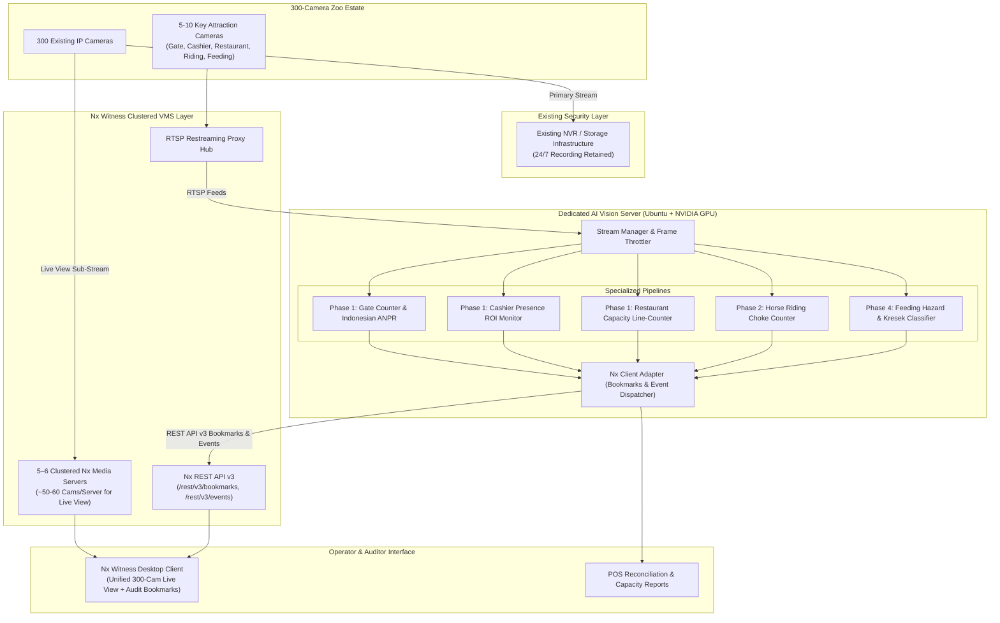

# Zoo & Safari Computer Vision & VMS System with Nx Witness
**Master Implementation Plan & Architecture Specification**

A comprehensive computer vision and video management system (VMS) implementation plan across a **300-camera park estate**, retaining the existing video recording system while deploying a **clustered Nx Witness layer (~5–6 servers)** for unified live view and targeted AI analytics.

---

## 1. Use Case Matrix

| Use Case | Difficulty | Business Goal | Technical Approach | Key Dependencies |
| :--- | :--- | :--- | :--- | :--- |
| **1. Vehicle Entry/Exit Counting** | **Easy** | Traffic & gate revenue audit | Off-the-shelf vehicle detection + directional line-crossing; test existing Nx LPR plugins with custom Indonesian OCR fallback (`B 1234 ABC`). | None — check existing Nx LPR plugin compatibility for Indonesian plates. |
| **2. Cashier Presence Check** | **Easy** | Staff accountability & service SLA | Low-frequency person presence detection (0.2 FPS) in a fixed cashier ROI zone; trigger alert when desk is unattended for $>X$ minutes. | None — deployable on existing cashier camera(s). |
| **3. Restaurant People-Counting** | **Easy** | Real-time occupancy & capacity management | Doorway bidirectional line-crossing counter (In / Out) using YOLO + ByteTrack. | Confirm camera covers doorway choke point clearly without blind spots. |
| **4. Horse-Riding Revenue Count** | **Easy–Medium** | Anti-fraud revenue assurance | Mount-point choke camera detection + ByteTrack + line-crossing logic; filter out walking staff handlers; count paying riders. | Mount-point camera already has a confirmed choke point. ✓ |
| **5. Feeding-Item Classification** | **Hard** | Animal welfare & hazard prevention | Custom-trained fine-grained classifier (authorized raw vegetables vs. plastic bags/kresek, snack wrappers, bread); hand-to-mouth ROI logic. | Station site survey; new close-up cameras + network cabling; labeled dataset collected over feeding windows. |

---

## 2. Phased Rollout Roadmap

```mermaid
gantt
    title Zoo Computer Vision & VMS Rollout Plan
    dateFormat  X
    axisFormat Wk %s

    section Phase 1: Foundation & Quick Wins
    Deploy Clustered Nx Witness (5-6 Servers) :active, p1_vms, 0, 4
    Camera Stream Audit & Restream Setup     :active, p1_stream, 1, 3
    Deploy Vehicle Gate Counting & LPR       :p1_gate, 3, 6
    Deploy Cashier Presence Check            :p1_cashier, 4, 6
    Deploy Restaurant People Counter         :p1_rest, 5, 8
    Phase 1 Reporting & Operator Live View   :milestone, m1, 8, 8

    section Phase 2: Horse-Riding Audit
    Collect & Annotate Mount Choke Footage   :p2_data, 4, 7
    Model Fine-Tuning & Handler Filtering    :p2_model, 6, 9
    Validation Against Ticketing / POS Logs  :p2_val, 8, 12
    Phase 2 Automated Reconciliation Launch  :milestone, m2, 12, 12

    section Phase 3: Feeding Site Survey & Infra
    Per-Station Camera & Angle Survey        :p3_survey, 6, 9
    Cabling & Network Drop Distance Sizing   :p3_cable, 8, 12
    Hardware Procurement & Camera Install    :p3_inst, 11, 16
    Infrastructure Sign-Off (8-10 Stations)  :milestone, m3, 16, 16

    section Phase 4: Feeding Classification Model
    Dataset Collection Across Feeding Windows:p4_data, 13, 20
    Model Training & Validation (Kresek/Bags):p4_train, 18, 24
    Field Testing, SLA Agreement & Retraining:p4_field, 22, 28
    Phase 4 Operational Alerting Go-Live     :milestone, m4, 28, 28
```



---

### Phase 1: Foundation & Quick Wins (Est. 4–8 Weeks)
* **Objective**: Stand up the unified VMS integration layer and deliver the highest-confidence, low-complexity use cases to demonstrate immediate operational ROI.
* **Key Tasks**:
  1. **Clustered Nx Witness Deployment**: Deploy ~5–6 clustered Nx Media Server instances across the 300-camera estate (~50–60 cameras per server) for centralized live view. **Existing recording stays in the current NVR/storage system**.
  2. **Camera Stream Limits & Restreaming**: Audit RTSP stream limits per camera model. Configure Nx Server to act as the RTSP restreaming proxy to protect camera hardware encoders from saturation.
  3. **Vehicle Entry/Exit Counting**: Check off-the-shelf Nx-compatible vehicle/LPR plugins. If Indonesian plates require custom handling, deploy the lightweight Python OCR module.
  4. **Cashier Presence Check**: Set up ROI bounding polygons on existing cashier desk cameras; configure idle absence alert timers (e.g. >5 minutes empty during shift hours).
  5. **Restaurant People-Counting**: Deploy bidirectional line-crossing counter on confirmed doorway angles.
* **Deliverable**: Working live-view operator interface via Nx Witness Desktop, plus a reporting dashboard for Vehicle Traffic, Cashier Presence, and Restaurant Occupancy.

---

### Phase 2: Horse-Riding Revenue Count (Est. 6–10 Weeks, Overlaps Phase 1)
* **Objective**: Ship the automated revenue-audit use case for the animal riding attraction, validating counts against POS records.
* **Key Tasks**:
  1. **Footage Extraction**: Capture sample footage from the confirmed mount-point choke camera across peak and non-peak hours.
  2. **Model Adaptation**: Fine-tune person/horse detection to the specific mounting platform angle; enforce staff handler rejection (ignore unmounted handlers leading the animal on foot).
  3. **Tracking & Debounce Logic**: Implement ByteTrack with directional line-crossing at the departure dock to eliminate double-counting during queue pauses.
  4. **Ticketing Reconciliation Validation**: Run parallel audits against manual ticket / POS sales over a 2–3 week validation period to tune edge cases before making counts authoritative.
* **Deliverable**: Automated rider count engine posting `#ride_audit` bookmarks into Nx Witness, with daily reconciliation reports comparing CV passenger counts against POS ticket logs.

---

### Phase 3: Feeding-Station Site Survey & Camera Work (Timeline Pending Site Walk-Through)
* **Objective**: Establish physical and network infrastructure across feeding points before attempting computer vision model development.
* **Key Tasks**:
  1. **Per-Station Survey**: Walk through all feeding stations to classify camera suitability:
     - *Usable with Reframing/Zoom*: e.g., Giraffe platform (adjusting existing PTZ/lens).
     - *Requires New Close-Up Camera*: e.g., Plaza Gajah / Elephant station (currently wide-angle only, cannot resolve items in visitor hands).
  2. **Cabling & Network Distance Sizing**: Determine physical cable run distances from feeding stations to the nearest PoE access switch (typically the real schedule and budget driver).
  3. **Scope Selection**: Select which 8–10 high-traffic routine feeding / keeper-talk points launch in Phase 4 vs. rotating/seasonal points added later.
* **Deliverable**: Station-by-station infrastructure blueprint with BOM, cabling distances, and camera installation timelines.

---

### Phase 4: Feeding-Item Classification Model (Est. 3–6+ Months, Runs Parallel with Phase 3)
* **Objective**: Build, train, and field-test the custom deep learning model distinguishing authorized food from hazardous prohibited items.
* **Key Realities & Constraints**:
  - *Calendar-Time-Bound Data Collection*: Feeding only occurs during short daily windows (e.g. 10:00–11:00 AM and 2:00–3:00 PM), meaning footage must be collected over weeks, not days.
  - *The Long-Tail Problem*: Visitors continuously introduce novel snack packaging, local food wrappers, and candy items not seen in initial training.
* **Key Tasks**:
  1. **Dataset Collection**: Harvest and annotate footage across installed station cameras (classes: `raw_carrot`, `vegetables`, `banana`, `plastic_bag_kresek`, `snack_wrapper`, `plastic_bottle`, `bread_pastry`).
  2. **Model Training & Active Learning**: Train fine-grained classifier; build an active learning pipeline to retrain on newly flagged unknown items.
  3. **Operational SLA Agreement**: Agree in advance on realistic accuracy benchmarks with management (e.g., 85–90% precision on plastic bags / *kresek*, acknowledging 100% is physically impossible due to occlusion).
* **Deliverable**: Real-time feeding hazard alerting system creating high-priority alarm popups in Nx Witness Desktop with direct video bookmarks.

---

## 3. System Architecture & Topology



---

## 4. Project Directory Structure

```
zoo-monitor/
├── docs/
│   ├── 01_IMPLEMENTATION_PLAN.md   # Master architecture and phased roadmap
│   ├── 02_MODEL_BUILDING_GUIDE.md   # PyTorch, transfer learning, and training guide
│   └── 03_HARDWARE_SPECIFICATIONS.md # Hardware sizing, GPU math, and network topology
├── configs/
│   ├── app_config.yaml             # Nx server cluster IPs, credentials, logging
│   ├── cameras.yaml                # Targeted camera assignments (RTSP endpoints, FPS)
│   └── rules/
│       ├── vehicle_gate.yaml       # Gate tripwire coordinates, Indonesian plate regex
│       ├── cashier_presence.yaml   # Cashier desk ROI polygons, idle absence timers
│       ├── restaurant_counter.yaml # Restaurant entrance/exit tripwires & capacity limits
│       ├── horse_riding.yaml       # Mount choke coordinates, handler rejection rules
│       └── feeding_hazard.yaml     # Hazard classes (kresek, wrapper, bread), hand ROI
├── core/
│   ├── stream_manager.py           # Multi-threaded RTSP ingest via Nx proxy with auto-reconnect
│   ├── base_pipeline.py            # Abstract base class (detect → track → evaluate → dispatch)
│   ├── detector.py                 # Ultralytics YOLOv11 inference wrapper (TensorRT/FP16)
│   ├── tracker.py                  # ByteTrack multi-object tracker
│   └── visualizer.py               # Debug annotations and ROI overlays
├── pipelines/
│   ├── vehicle_gate_pipeline.py    # Phase 1: Gate vehicle classification & Indonesian ANPR
│   ├── cashier_presence_pipeline.py# Phase 1: Cashier desk occupancy & absence alert
│   ├── restaurant_pipeline.py      # Phase 1: In/Out doorway line-crossing counter
│   ├── horse_riding_pipeline.py    # Phase 2: Mount-point choke counter with handler filter
│   └── feeding_pipeline.py         # Phase 4: Prohibited item classifier & hand-to-mouth logic
├── nx_integration/
│   ├── nx_client.py                # Nx Witness REST API v3 wrapper (token auth, keep-alive)
│   └── bookmark_manager.py         # Audit bookmark dispatcher (#ride_audit, #vehicle_audit, etc.)
├── sample_data/                    # Test video clips & choke-point test loops
├── main.py                         # Application entrypoint & multi-pipeline orchestrator
├── requirements.txt                # Python dependencies
├── Dockerfile                      # GPU-accelerated container image (CUDA 12)
├── docker-compose.yml              # Multi-container deployment with GPU passthrough & env vars
└── README.md                       # Setup and deployment documentation
```
