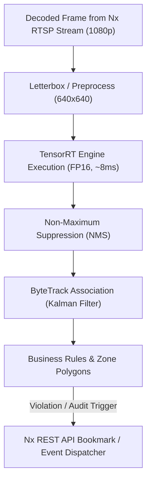

# Model Building, Training & Architecture Guide
**Zoo Computer Vision System (PyTorch + YOLOv11 + ByteTrack + PaddleOCR)**

This document provides a comprehensive technical guide explaining **why and how** the AI models are built, trained, and optimized for production deployment.

---

## 1. Core Framework Selection: Why PyTorch?

We use **PyTorch** exclusively for all model training, fine-tuning, and inference. TensorFlow is **not used** for the following architectural reasons:

| Factor | PyTorch | TensorFlow | Why It Matters For This Project |
| :--- | :--- | :--- | :--- |
| **YOLOv11 Support** | ⭐⭐⭐ **Native & Official** | ❌ Unofficial community ports only | Ultralytics built YOLOv8/v11 natively in PyTorch. There is no official TensorFlow implementation. |
| **NVIDIA TensorRT Export** | ⭐⭐⭐ **1-Line Native Export** | ⚠️ Fragile TF-TRT pipeline | Converting PyTorch `.pt` $\to$ `.engine` is a single function call. TF requires complex graph freezing. |
| **Indonesian Plate OCR** | ⭐⭐⭐ **PaddleOCR / ONNX native** | ⚠️ Complex format conversions | PP-OCRv4 interfaces seamlessly with PyTorch tensor workflows. |
| **Debugging & Development** | ⭐⭐⭐ **Eager execution (Pythonic)** | ⚠️ Cryptic graph tracing errors | Standard Python `print()` and `pdb` breakpoints work directly inside model code. |
| **Ecosystem Market Share** | ⭐⭐⭐ **~88% of CV Research** | ⚠️ ~8% of CV Research | Virtually every modern computer vision paper (CVPR, ICCV) publishes weights in PyTorch. |

---

## 2. Transfer Learning Strategy by Use Case

A common misconception is that all computer vision models must be trained from scratch. In production, we use a tiered strategy:

```
┌────────────────────────────────────────────────────────────────────────┐
│ TIER 1: ZERO TRAINING (Day-1 Out-of-the-Box COCO Pretrained Weights)   │
│ • Vehicle Gate (Car, Bus, Motorcycle, Truck)                           │
│ • Cashier Presence Check (Person @ 0.2 FPS)                            │
│ • Restaurant People Counting (Person line-crossing)                   │
├────────────────────────────────────────────────────────────────────────┤
│ TIER 2: MINOR FINE-TUNING (~150–300 Annotated Station Frames)          │
│ • Horse-Riding Revenue Audit (Mount platform angle & handler filter)   │
├────────────────────────────────────────────────────────────────────────┤
│ TIER 3: FULL CUSTOM TRANSFER LEARNING (Custom Zoo Labeled Dataset)     │
│ • Feeding Hazard Classification (Carrot/Greens vs Kresek/Wrappers)     │
└────────────────────────────────────────────────────────────────────────┘
```

### Detailed Breakdown

#### 1. Vehicle Entry/Exit & Gate Counting (Tier 1: Zero Training)
* **Model**: `yolo11s.pt` (Small) or `yolo11m.pt` (Medium) pre-trained on Microsoft COCO.
* **Why No Training Needed**: COCO already contains hundreds of thousands of images of `car` (Class 2), `motorcycle` (Class 3), `bus` (Class 5), and `truck` (Class 7).
* **Tracking**: ByteTrack associates bounding boxes across frames to compute directional vectors (Inbound vs. Outbound tripwires).
* **Indonesian License Plate OCR**:
  1. YOLO locates the `license_plate` bounding box.
  2. Bounding box crop is passed to **PaddleOCR (PP-OCRv4)** text detector + text recognizer.
  3. Output string is sanitized via Indonesian plate regex: `^[A-Z]{1,2}\s?\d{1,4}\s?[A-Z0-9]{1,3}$`.

#### 2. Cashier Presence Check (Tier 1: Zero Training)
* **Model**: `yolo11n.pt` (Nano).
* **Why No Training Needed**: Pre-trained `person` (Class 0) detection is robust out-of-the-box.
* **Sampling Rate**: Low frequency (1 frame every 5 seconds = 0.2 FPS).
* **Logic**: If bounding box center falls within cashier desk polygon $\to$ `PRESENCE = TRUE`. If absent for $>X$ minutes during shift $\to$ dispatch alert.

#### 3. Restaurant Capacity Counter (Tier 1: Zero Training)
* **Model**: `yolo11s.pt` (Small) + ByteTrack.
* **Why No Training Needed**: Pre-trained `person` detector tracking across doorway entrance/exit lines.
* **Logic**: $\text{Current Occupancy} = \sum \text{Inbound} - \sum \text{Outbound}$.

#### 4. Horse-Riding Revenue Count (Tier 2: Minor Fine-Tuning)
* **Model**: `yolo11m.pt` fine-tuned on the specific mount choke-point camera.
* **Classes**:
  * `horse`
  * `camel`
  * `mounted_rider` (person seated on saddle)
  * `ground_handler` (staff walking on foot holding leash)
* **Dataset Size Needed**: ~150 to 300 annotated images extracted from the platform camera.
* **Why Fine-Tune?**: Eliminates ambiguity between a paying rider seated on the saddle vs. a park staff member walking alongside the animal.

#### 5. Feeding-Item Classification (Tier 3: Full Transfer Learning)
* **Model**: `yolo11m.pt` or `yolo11x.pt` with custom detection heads.
* **Target Classes**:
  * **Allowed Feed**: `raw_carrot`, `banana`, `leafy_greens`
  * **Prohibited Hazards**: `plastic_bag_kresek`, `snack_wrapper`, `plastic_bottle`, `bread_pastry`
  * **Anatomical Anchor**: `human_hand`, `animal_mouth`
* **Why Transfer Learning is Mandatory**: Pre-trained COCO models have no concept of Indonesian *kantong kresek* (thin plastic bags) or local snack packaging.
* **Transfer Learning Workflow**: We freeze the general vision feature extractor (YOLOv11 backbone) and train the detection heads on labeled zoo feeding images.

---

## 3. Step-by-Step Training Workflow in Jupyter / Colab

For Phases 2 & 4, model training is conducted in a **Jupyter Notebook** (or Google Colab / cloud GPU instance).

### Step 1: Install Dependencies
```bash
pip install ultralytics torch torchvision paddlepaddle paddleocr opencv-python
```

### Step 2: Prepare Dataset Configuration (`dataset.yaml`)
Organize your labeled images (annotated via Roboflow or CVAT) in standard YOLO format:

```yaml
# dataset.yaml
path: /workspace/datasets/zoo_feeding
train: images/train
val: images/val

names:
  0: raw_carrot
  1: leafy_greens
  2: banana
  3: plastic_bag_kresek
  4: snack_wrapper
  5: plastic_bottle
  6: bread_pastry
  7: human_hand
  8: animal_mouth
```

### Step 3: Run Transfer Learning in Jupyter Notebook
```python
from ultralytics import YOLO
import torch

# Verify GPU availability
print(f"CUDA Available: {torch.cuda.is_available()}")
print(f"Device Name: {torch.cuda.get_device_name(0)}")

# 1. Load the pre-trained PyTorch weights (transfers visual feature extraction)
model = YOLO('yolo11m.pt')

# 2. Train / Fine-tune on custom dataset
results = model.train(
    data='dataset.yaml',
    epochs=60,
    imgsz=640,
    batch=16,
    device=0,
    patience=15,          # Early stopping if no improvement for 15 epochs
    save=True,
    project='zoo_models',
    name='feeding_hazard_v1'
)
```

### Step 4: Validate Model Metrics in Jupyter
Ultralytics automatically generates performance evaluation artifacts:
* **Confusion Matrix** (`confusion_matrix.png`): Confirms that *kresek* is never confused with *leafy greens*.
* **Precision-Recall Curve** (`PR_curve.png`): Validates operational threshold settings.
* **Validation Loss Curves** (`results.png`): Confirms convergence without overfitting.

```python
# Validate the fine-tuned model on the test split
metrics = model.val()
print(f"mAP@50: {metrics.box.map50:.4f}")
print(f"mAP@50-95: {metrics.box.map:.4f}")
```

### Step 5: Export to High-Speed NVIDIA TensorRT (FP16)
Once validation criteria are satisfied, export the model to an optimized TensorRT engine file for production deployment:

```python
# Exports best.pt -> best.engine (TensorRT FP16)
model.export(
    format='engine',
    half=True,        # Use 16-bit floating point for 2x speedup
    device=0,
    workspace=4       # 4GB max GPU workspace for TensorRT builder
)
```

---

## 4. Production Inference Engine (How Models Run in Production)

In production on the Ubuntu Linux server, models do **NOT** run inside Jupyter. They run inside a headless, multi-threaded Python service managed by Docker.

### Pipeline Flow per Frame



### Indonesian License Plate Recognition Pipeline (Code Template)

```python
import re
import cv2
from paddleocr import PaddleOCR

class IndonesianLPR:
    def __init__(self):
        # Initialize PaddleOCR Latin reader (lightweight, runs in ~12ms)
        self.ocr = PaddleOCR(use_angle_cls=True, lang='en', show_log=False)
        # Regex for Indonesian plates: [1-2 letters] [1-4 digits] [1-3 letters/numbers]
        self.plate_pattern = re.compile(r'^[A-Z]{1,2}\s?\d{1,4}\s?[A-Z0-9]{1,3}$')

    def read_plate(self, plate_crop_bgr):
        # 1. Grayscale & Contrast Normalization
        gray = cv2.cvtColor(plate_crop_bgr, cv2.COLOR_BGR2GRAY)
        
        # 2. OCR Inference
        result = self.ocr.ocr(gray, cls=True)
        if not result or not result[0]:
            return None

        # 3. Concatenate and clean recognized tokens
        raw_text = "".join([line[1][0] for line in result[0]]).upper().strip()
        cleaned_text = re.sub(r'[^A-Z0-9\s]', '', raw_text)

        # 4. Validate syntax against Indonesian vehicle standards
        if self.plate_pattern.match(cleaned_text):
            return cleaned_text
        return None
```

---

## 5. Summary Checklist for Engineering Team

| Stage | Tool / Stack | Action Items |
| :--- | :--- | :--- |
| **Phase 1 Deployment** | PyTorch + COCO Weights | Deploy `yolo11s.pt` directly for Gate, Cashier, and Restaurant. Zero labeling required. |
| **Phase 2 Dataset** | Mount Choke Camera | Record 2 hours of footage; label 200 frames for rider vs. handler. Fine-tune in Jupyter. |
| **Phase 4 Dataset** | Feeding Platforms | Record feeding windows (10–11 AM, 2–3 PM). Label carrots, kresek, wrappers. Train custom YOLOv11. |
| **GPU Optimization** | TensorRT 10.x | Always run `model.export(format='engine', half=True)` before deploying to production. |
| **Production Runtime** | Docker + CUDA 12 | Deploy via `docker-compose.yml` with NVIDIA Container Toolkit. No Jupyter in production. |
