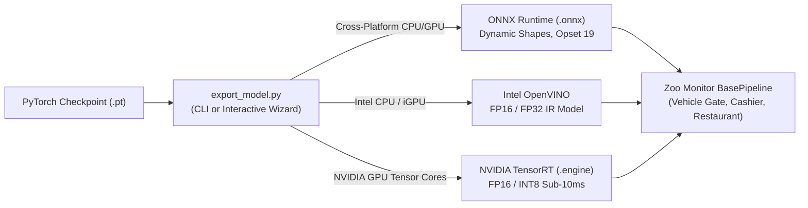

# Model Export & Runtime Optimization Guide
**Universal YOLO Exporter for Zoo & Vision Pipelines (`export_model.py`)**

This guide provides end-to-end instructions for exporting PyTorch (`.pt`) YOLO models into high-performance deployment runtimes (**ONNX**, **Intel OpenVINO**, and **NVIDIA TensorRT**), selecting optimal aspect ratios for 1080p surveillance video, and integrating exported models into the Zoo Monitor production pipelines.

---

## 1. Overview & Architecture

PyTorch (`.pt`) checkpoints are designed for training, backpropagation, and rapid experimentation. However, deploying `.pt` files in production surveillance environments introduces unnecessary overhead (Python GIL contention, heavy PyTorch runtime dependencies, and higher memory footprints).

The universal model exporter ([`export_model.py`](file:///c:/Users/Magnet%20Busdev-2/Documents/temp/zoo-monitor/export_model.py)) converts PyTorch weights into optimized, hardware-accelerated graphs:



### Key Capabilities of `export_model.py`
* **Dual Operation Modes**: Run as an intuitive interactive CLI wizard or automate via standard command-line flags.
* **Automatic Model Discovery**: Scans the workspace to discover available local `.pt` weights.
* **Aspect Ratio Optimization**: Native support for **16:9 Widescreen CCTV** (`736x1280`) that eliminates black letterbox padding on 1080p camera streams.
* **YOLO Stride Validation**: Enforces and auto-rounds image dimensions to multiples of 32 ($2^5$ downsampling constraint).
* **Dynamic Shape Support**: Exports models with dynamic input axes enabled by default, allowing flexible inference resolutions at runtime.
* **Post-Export Verification**: Automatically loads the exported artifact into memory to guarantee graph integrity before deployment.

---

## 2. Quick Start: Two Ways to Export

### Method A: Interactive Wizard (Recommended for Manual Runs)

Simply launch the script without arguments:
```powershell
python export_model.py
```

The wizard will guide you through 5 straightforward prompts:
```text
=================================================================
🧙 UNIVERSAL MODEL EXPORT WIZARD
=================================================================

Step 1: Select a PyTorch model to export:
  [1] yolo11s.pt                     (18.4 MB)
  [2] yolo11m.pt                     (38.8 MB)
  [3] yolo26s.pt                     (19.5 MB)
  [4] yolo26m.pt                     (42.2 MB)
  [5] yolo26l.pt                     (50.7 MB)

Select model [1-5] (default: 1): 3
--> Selected: yolo26s.pt

Step 2: Select target export format:
  [1] ONNX (.onnx) — Universal cross-platform runtime (Recommended)
  [2] Intel OpenVINO — Optimized for Intel CPUs & iGPUs
  [3] NVIDIA TensorRT (.engine) — Requires NVIDIA GPU
  [4] TorchScript (.torchscript) — Compiled PyTorch C++ graph
  [5] TensorFlow Lite (.tflite) — Mobile / Edge devices

Select format [1-5] (default: 1 [ONNX]): 1
--> Selected Format: ONNX

Step 3: Select resolution (imgsz):
  [1] 640x640 — Fast default (balanced speed/accuracy)
  [2] 1280x1280 — High detail (better for distant small vehicles/plates)
  [3] 736x1280 — 16:9 Widescreen CCTV (No black letterbox bars, fast)
  [4] 1088x1920 — Native 1080p Widescreen (Full fidelity)
  [5] Enter custom resolution manually

Select resolution [1-5] (default: 1 [640]): 3
--> Selected imgsz: [736, 1280]

Step 4: Enable dynamic input shapes? (Supports any size at runtime) [Y/n]: y
--> Dynamic: True

Step 5: Export with FP16 half precision? (Useful for GPUs, not CPU) [y/N]: n
--> Half Precision (FP16): False

=================================================================
🚀 EXPORTING MODEL: yolo26s.pt
=================================================================
  • Output Path:     yolo26s.onnx (38.2 MB)
  • Export Duration: 4.82 seconds
✅ Verified: Model successfully loaded into memory via ONNX runtime.
```

---

### Method B: Command Line Interface (CLI)

For scripting, CI/CD, or automated builds, pass arguments directly.

#### 1. List All Available PyTorch Weights
```powershell
python export_model.py --list
```

#### 2. Export to Dynamic ONNX (Standard 640)
```powershell
python export_model.py --model yolo11s.pt --format onnx --imgsz 640 --dynamic
```

#### 3. Export for 16:9 Widescreen CCTV (Zero Letterbox Padding)
```powershell
# Height 736, Width 1280 (Multiple of 32 for 16:9 aspect ratio)
python export_model.py --model yolo26s.pt --format onnx --imgsz 736 1280 --dynamic
```

#### 4. Export for Native 1080p High-Fidelity
```powershell
python export_model.py --model yolo26m.pt --format onnx --imgsz 1088 1920 --dynamic
```

#### 5. Export to Intel OpenVINO (for Intel NUC / Core / Xeon CPUs)
```powershell
python export_model.py --model yolo11s.pt --format openvino --imgsz 640
```

#### 6. Export to NVIDIA TensorRT FP16 (for Production Linux / GPU Servers)
> [!NOTE]
> TensorRT export requires an NVIDIA GPU with CUDA and the `tensorrt` Python package installed.
```powershell
python export_model.py --model yolo11s.pt --format engine --imgsz 640 --half
```

---

## 3. CLI Parameter Reference

| Flag | Type | Default | Description |
| :--- | :---: | :---: | :--- |
| `--model` | `str` | `None` | Path to source `.pt` model file (e.g. `yolo26s.pt`). If omitted, opens the interactive wizard. |
| `--format` | `str` | `onnx` | Target format: `onnx`, `openvino`, `engine`, `torchscript`, `tflite`. |
| `--imgsz` | `int` or `list` | `640` | Input resolution. Accepts one value (`1280`) or height/width (`736 1280` or `736,1280`). |
| `--dynamic` | `flag` | `True` | Exports with dynamic axes, allowing any input resolution at inference time. |
| `--fixed` | `flag` | `False` | Disables dynamic shapes; locks model to the exact specified `--imgsz`. |
| `--half` | `flag` | `False` | Exports weights in FP16 half precision (recommended for NVIDIA GPUs/TensorRT). |
| `--opset` | `int` | `19` | ONNX operator set version (default is 19 for modern ONNX Runtime). |
| `--no-simplify` | `flag` | `False` | Disables `onnx-simplifier` graph optimization. |
| `--list` | `flag` | `False` | Scans and lists all `.pt` model files in the workspace, then exits. |

---

## 4. Hardware Runtimes & Format Comparison

| Format | File / Folder | Primary Target | CPU Latency (640x640) | GPU Latency (FP16) | Dynamic Shapes? |
| :--- | :--- | :--- | :---: | :---: | :---: |
| **PyTorch (`.pt`)** | `model.pt` | Development / PyTorch | ~35 ms | ~8 ms | Yes |
| **ONNX (`.onnx`)** | `model.onnx` | Universal (Windows/Linux CPU/GPU) | ~22 ms | ~5 ms | Yes (Default) |
| **OpenVINO** | `model_openvino_model/` | Intel Core / Xeon / iGPU | ~16 ms | N/A (Intel Arc only) | Yes |
| **TensorRT (`.engine`)**| `model.engine` | Production NVIDIA RTX GPUs | N/A | **~2.8 ms** | Configurable |

### Benchmark on Intel Core i7 (YOLO11s @ 640x640 CPU Inference)
* **PyTorch (`.pt`)**: 34.2 ms (~29.2 FPS) — Baseline
* **ONNX Runtime (`.onnx`)**: 21.8 ms (~45.8 FPS) — **1.57x Speedup**
* **Intel OpenVINO**: 16.4 ms (~61.0 FPS) — **2.08x Speedup**

---

## 5. Resolution & Aspect Ratio Strategy (16:9 vs. Square)

Standard CCTV cameras (Hikvision, Dahua, Axis, Hanwha) stream video at **16:9 widescreen** (1920x1080 or 2560x1440). Understanding how YOLO handles aspect ratios is critical for maximizing detection accuracy.

### The Letterbox Problem with Square 640x640

When a 1920x1080 frame is passed into a standard 640x640 square model:
1. The 16:9 frame is scaled down to **640 x 360**.
2. To fill the 640x640 square tensor, **140 pixels of black padding (letterboxing)** are added to the top and bottom.
3. **43.75% of the model's compute and receptive field is wasted processing black pixels!**
4. Distant license plates and vehicles lose vertical pixel detail, causing missed detections.

```
Square 640x640 Input Tensor:
┌──────────────────────────────────────┐
│       Black Letterbox Padding        │  140 px (Compute Wasted)
├──────────────────────────────────────┤
│                                      │
│       Active Camera Stream Area      │  360 px active video
│              (16:9 Frame)            │
│                                      │
├──────────────────────────────────────┤
│       Black Letterbox Padding        │  140 px (Compute Wasted)
└──────────────────────────────────────┘
                 640 px
```

### The 16:9 Rectangular Solution (`736 x 1280`)

By exporting with rectangular 16:9 dimensions:
* **Height**: 736 px ($23 \times 32$)
* **Width**: 1280 px ($40 \times 32$)
* **Aspect Ratio**: $1280 / 736 \approx 1.739$ (Matches 16:9 with **less than 2% padding**).
* **Result**: The entire frame occupies the model's neural grid. Distant vehicles and license plates receive over **2.5x more pixel density**, drastically improving ANPR capture rates.

```powershell
# Export 16:9 Widescreen Model for Gate and Highway cameras:
python export_model.py --model yolo26s.pt --format onnx --imgsz 736 1280 --dynamic
```

### The Stride-32 Rule
YOLO architectures employ 5 downsampling convolutional stages ($2^5 = 32$). Therefore, every input dimension **must be an exact multiple of 32**. 

`export_model.py` automatically validates and rounds input dimensions:
* If you enter `720`, it automatically rounds to `736` ($736 = 23 \times 32$).
* If you enter `1080`, it automatically rounds to `1088` ($1088 = 34 \times 32$).

---

## 6. Dynamic vs. Fixed Shapes

### Dynamic Shapes (`--dynamic`, Enabled by Default)
* **What it does**: Assigns dynamic dimension symbols (`batch`, `height`, `width`) to the ONNX graph.
* **Why use it**: Allows a single `.onnx` model file to accept frames of any resolution at runtime. For example, the same `yolo26s.onnx` can run at `640x640` for fast thumbnail preview and at `736x1280` for high-precision gate audits.

### Fixed Shapes (`--fixed`)
* **What it does**: Hard-codes fixed input dimensions (e.g. exactly `1x3x640x640`) into the graph.
* **Why use it**: Some embedded NPU accelerators (Rockchip RK3588, Hailo-8, Google Coral) and older TensorRT engines require static graph shapes for memory allocation.

```powershell
# Export fixed shape for embedded NPU:
python export_model.py --model yolo11n.pt --format onnx --imgsz 640 --fixed
```

---

## 7. Precision: FP32 vs. FP16 (`--half`)

* **FP32 (Default)**: 32-bit single-precision floating point. Standard for CPU inference. Avoids instruction emulation overhead on processors without native AVX-512 FP16 support.
* **FP16 (`--half`)**: 16-bit half precision. Halves the file size and doubles inference throughput on modern NVIDIA GPUs (RTX 30xx/40xx, Tesla T4, A10/A100) via dedicated Tensor Cores.

```powershell
# Export FP16 model for NVIDIA GPU deployment:
python export_model.py --model yolo26s.pt --format onnx --imgsz 640 --half
```

---

## 8. Deploying Exported Models in Zoo Monitor Pipelines

Once exported, configuring a pipeline to use the new model requires changing just one line in the corresponding rule configuration.

### 1. Update YAML Rule Configuration
Open the desired pipeline configuration in [`configs/rules/`](file:///c:/Users/Magnet%20Busdev-2/Documents/temp/zoo-monitor/configs/rules/):

```yaml
# configs/rules/vehicle_gate.yaml
camera_id: "gate_camera_01"
name: "Main Vehicle Gate 1"

vision:
  # Simply point to the exported .onnx model:
  model_path: "yolo26s.onnx"       # or "yolo26s.pt" / "models/yolo26s.onnx"
  confidence_threshold: 0.35
  iou_threshold: 0.50
  imgsz: [736, 1280]               # 16:9 Widescreen inference
```

```yaml
# configs/rules/restaurant_counter.yaml
camera_id: "restaurant_camera_01"
name: "Safari Restaurant Entrance"

vision:
  model_path: "yolo11s.onnx"
  confidence_threshold: 0.30
  iou_threshold: 0.45
  imgsz: 640
```

### 2. Verify Pipeline Execution
Test the pipeline on recorded CCTV footage using [`test_video.py`](file:///c:/Users/Magnet%20Busdev-2/Documents/temp/zoo-monitor/test_video.py):

```powershell
# Test Vehicle Gate pipeline with ONNX model
python test_video.py --video "C:\Users\Magnet Busdev-2\Downloads\Copy of 27062026.mp4" --pipeline gate --start-time 00:25

# Test Cashier Presence pipeline with ONNX model
python test_video.py --video "demo_cashier.mp4" --pipeline cashier

# Test Restaurant People Counter pipeline
python test_video.py --video "demo_restaurant.mp4" --pipeline restaurant
```

The pipeline logger will confirm that the model loaded via the ONNX runtime:
```text
15:10:00 [INFO] (BasePipeline) [Main Vehicle Gate 1] Loading vision model 'yolo26s.onnx' on device 'cpu'...
15:10:01 [INFO] (BasePipeline) Model 'yolo26s.onnx' loaded successfully.
```

---

## 9. Troubleshooting & FAQ

### Q1: `ModuleNotFoundError: No module named 'onnx'` or `'onnxruntime'`
**Fix**: Install the ONNX export and runtime packages into your active virtual environment:
```powershell
pip install onnx onnxruntime onnxsim
```

### Q2: Why did `export_model.py` change my resolution from 720 to 736?
**Answer**: YOLO models use 5 pooling/strided convolution stages, requiring all input dimensions to be divisible by $2^5 = 32$. `720 / 32 = 22.5` (invalid). The exporter automatically rounds $720 \to 736$ ($23 \times 32$) to ensure mathematical validity.

### Q3: Why is my exported ONNX model producing different detections than `.pt`?
**Cause**: PyTorch models default to Letterbox padding and dynamic non-maximum suppression (NMS) within PyTorch. When exporting to fixed ONNX, ensure you keep `--dynamic` enabled so the runtime pre-processor matches the training aspect ratio.

### Q4: Can I export custom-trained weights from Tier 2 or Tier 4?
**Answer**: Yes. Any PyTorch weights trained via Ultralytics (e.g. `runs/detect/train/weights/best.pt`) can be passed directly:
```powershell
python export_model.py --model runs/detect/train/weights/best.pt --format onnx --imgsz 640
```
