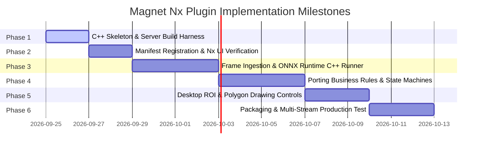

# Magnet AI Vision Analytics — Nx Meta Plugin Implementation Plan

**Author:** Magnet AI Team  
**Platform:** Network Optix MetaVMS (Nx Meta 6.1.2 / `metavms-server`)  
**Target Architecture:** Native C++ In-Process Analytics Plugin (`libmagnet_analytics_plugin.so`)  
**Target Server:** Linux (Ubuntu 20.04 / 22.04 LTS)  
**SDK Package:** `metavms-server_plugin_sdk-6.1.2.42921-universal.zip`  

---

## 1. Executive Summary

This document defines the roadmap for building **Magnet AI Vision Analytics**, a high-performance native C++ analytics plugin for **Network Optix MetaVMS**.

By executing natively inside the `networkoptix-metavms-mediaserver` daemon:
1. **Zero-Copy Performance**: Decoded video frames pass straight from the media engine to inference memory without RTSP re-encoding or network socket latency.
2. **Native Nx Desktop Experience**: Bounding boxes, visitor tracks, queue statistics, and cashier attendance statuses render directly inside the Nx Desktop Client camera view.
3. **Integrated Event Rules**: Triggers Nx native bookmarks, desktop popups, alarms, and push notifications directly through the VMS event bus.
4. **Hardware Efficiency**: Replaces Python runtime overhead and GIL locking with vectorized C++ and multi-threaded ONNX Runtime execution.

---

## 2. System Architecture

```mermaid
graph TD
    subgraph Nx Meta Mediaserver Daemon (Linux)
        RTSP["RTSP Camera Streams"] --> MediaPipeline["Nx Media Engine"]
        MediaPipeline -->|Decoded YUV420 Frames| DeviceAgent["ConsumingDeviceAgent (Per Camera)"]
        
        subgraph Magnet AI Analytics Plugin (libmagnet_analytics_plugin.so)
            Integration["magnet::analytics::Integration<br/>(Manifest & Capabilities)"]
            Engine["magnet::analytics::Engine<br/>(Global Model Cache)"]
            ORT["ONNX Runtime C++ Engine"]
            Engine -->|Manages| ORT
            
            DeviceAgent --> Preproc["Color Conversion & Letterbox"]
            Preproc --> ORT
            ORT --> Postproc["Vectorized NMS & Tracker"]
            Postproc --> StateMachine["Magnet Rule State Machine<br/>(Cashier, Restaurant, Gate)"]
            StateMachine --> MetaPackets["IMetadataPacket & IEventMetadataPacket"]
        end
        
        MetaPackets --> NxStorage["Nx Metadata Engine & Event Bus"]
    end
    
    NxStorage --> NxDesktop["Nx Desktop Client (Live Bounding Boxes, Timeline, Search)"]
```

---

## 3. Brand Identity & Taxonomy in Nx Meta

### Plugin Identification
* **Vendor ID**: `magnet`
* **Vendor Name**: `Magnet`
* **Plugin ID**: `magnet.analytics`
* **Plugin Name**: `Magnet AI Vision Analytics`
* **Library Name**: `libmagnet_analytics_plugin.so`
* **C++ Namespace**: `magnet::analytics`

### Object Types (Taxonomy for Nx Search & Filtering)
| Object Type ID | Display Name | Attributes |
| :--- | :--- | :--- |
| `magnet.person.cashier` | **Magnet: Cashier Staff** | `State` (Attended, Absent), `DwellSeconds` |
| `magnet.person.visitor` | **Magnet: Visitor / Customer** | `Zone` (Queue, Dining, General), `WaitSeconds` |
| `magnet.vehicle` | **Magnet: Audited Vehicle** | `Direction` (Entry, Exit), `Speed` |
| `magnet.plate` | **Magnet: License Plate (ANPR)** | `PlateNumber`, `Confidence` |
| `magnet.animal.horse` | **Magnet: Riding Horse** | `TrackId`, `MotionDirection` |

### Event Types (Nx Event Rules & Alarm Dispatch)
| Event Type ID | Display Name | Trigger Condition |
| :--- | :--- | :--- |
| `magnet.event.cashier_unattended` | **Magnet: Cashier Desk Unattended** | Visitor present at desk with no cashier for > 15s |
| `magnet.event.visitor_unserved` | **Magnet: Customer Waiting Alert** | Customer queue waiting time exceeds threshold (e.g. 60s) |
| `magnet.event.occupancy_exceeded` | **Magnet: Area Capacity Exceeded** | Headcount exceeds dining/zone limit for > 10s |
| `magnet.event.vehicle_entry` | **Magnet: Vehicle Entry Gate Crossing** | Vehicle crosses entry tripwire in forward direction |
| `magnet.event.horse_departure` | **Magnet: Horse Ride Departure** | Horse crosses choke-point tripwire into riding circuit |
| `magnet.event.horse_return` | **Magnet: Horse Ride Return** | Horse crosses choke-point tripwire back into paddock/station |

---

## 4. Phase-by-Phase Roadmap



---

### Phase 1: Build Harness & Minimal Plugin Skeleton (MVP)
* **Goal**: Generate a minimal `libmagnet_analytics_plugin.so` on the Linux server that compiles cleanly and links against `metavms-server_plugin_sdk`.
* **Tasks**:
  1. Create directory `magnet_nx_plugin/` in this repository.
  2. Write `CMakeLists.txt` supporting both standalone builds (`-DnxSdkDir=...`) and in-tree SDK builds.
  3. Implement `plugin.cpp` exporting `extern "C" NX_PLUGIN_API nx::sdk::IIntegration* createNxPlugin()`.
  4. Write `build_on_server.sh` for one-command compilation on Linux.
* **Verification**:
  * Run `cmake` and `make` on the Linux server.
  * Verify output file exists: `build/libmagnet_analytics_plugin.so`.

---

### Phase 2: Manifest Registration & VMS Discovery
* **Goal**: Ensure the plugin loads into `networkoptix-metavms-mediaserver` and appears in the Nx Desktop Client GUI.
* **Tasks**:
  1. Implement `Integration::manifestString()` declaring `magnet.analytics`, vendor, version, and description.
  2. Implement `Engine::manifestString()` specifying `needUncompressedVideoFrames_yuv420`.
  3. Implement `DeviceAgent::manifestString()` declaring supported object and event types.
  4. Copy `.so` to `/opt/networkoptix-metavms/mediaserver/bin/plugins/` and restart server.
* **Verification**:
  * Open Nx Desktop Client -> Camera Settings -> **Plugins** tab.
  * Confirm **"Magnet AI Vision Analytics"** toggle is visible and can be enabled.
  * Check Nx server logs: `tail -f /opt/networkoptix-metavms/mediaserver/var/log/mediaserver.log`.

---

### Phase 3: Video Frame Ingestion & ONNX Runtime C++
* **Goal**: Ingest decoded camera frames and run inference with `yolo11s.onnx` or `yolo26s.onnx`.
* **Tasks**:
  1. Download prebuilt **ONNX Runtime C++ Linux x64** library (`libonnxruntime.so`).
  2. Implement `DeviceAgent::pushUncompressedVideoFrame`:
     * Read YUV420 plane buffers from `IUncompressedVideoFrame`.
     * Convert to RGB and resize/letterbox to model resolution (e.g. 640x640 or widescreen 1280x736).
     * Throttle processing to target analytics FPS (e.g., 5 FPS) to conserve server CPU.
  3. Load `.onnx` session in `Engine` (shared across device agents) and run inference.
  4. Implement vectorized NMS (Non-Maximum Suppression) in C++.
* **Verification**:
  * Verify bounding boxes appear overlaid on live camera stream in Nx Desktop.

---

### Phase 4: Porting Domain Rules & State Machines
* **Goal**: Port the Python zoo pipelines to native C++:
  1. **Cashier Presence & Dwell**:
     * Point-in-polygon math for Clerk and Visitor zones.
     * State machine (`ATTENDED`, `UNATTENDED`, `CUSTOMER_WAITING`, `IDLE`).
     * Dwell-time filters (rejecting transient passers-by).
  2. **Restaurant Occupancy**:
     * Dining area polygon filtering + temporal headcount smoothing.
  3. **Vehicle Gate Tripwire**:
     * Line-crossing vector check with ByteTrack trajectory orientation.
* **Verification**:
  * Trigger real events on test videos and confirm native Nx event bookmarks appear on the timeline.

---

### Phase 5: Interactive Nx Desktop ROI Configuration
* **Goal**: Allow operators to draw zones directly in the Nx Desktop Client.
* **Tasks**:
  1. Implement `DeviceAgentSettingsModel` JSON with `PolygonFigure` and `LineFigure`.
  2. Expose interactive UI controls:
     * Clerk Desk Polygon
     * Visitor Queue Polygon
     * Absence Alert Timeout (seconds)
  3. Read user-drawn coordinates dynamically in `DeviceAgent::settingsReceived()`.
* **Verification**:
  * Draw a zone polygon in Nx Desktop camera settings and verify the plugin updates its detection coordinates in real-time.

---

### Phase 6: Packaging, Multi-Stream Optimization & Deployment
* **Goal**: Deploy ready-to-run package for 24/7 park operations.
* **Tasks**:
  1. Add systemd service integration and automated update scripts.
  2. Stress test with 8 simultaneous camera feeds for 24 hours.
  3. Monitor CPU/RAM consumption against Python baseline.
* **Verification**:
  * Zero memory leaks (`valgrind` / ASan clean).
  * System load stays within server budget.

---

## 5. Directory Structure

```
zoo-monitor/
├── docs/
│   └── 06_MAGNET_NX_PLUGIN_IMPLEMENTATION_PLAN.md    <-- This Plan
├── magnet_nx_plugin/
│   ├── CMakeLists.txt                                <-- Build configuration
│   ├── build_on_server.sh                            <-- Server build & deploy automation
│   ├── plugin.cpp                                    <-- Entry point (createNxPlugin)
│   ├── src/
│   │   ├── integration.h                             <-- Plugin Manifest
│   │   ├── integration.cpp
│   │   ├── engine.h                                  <-- Inference & Model Cache
│   │   ├── engine.cpp
│   │   ├── device_agent.h                            <-- Per-Camera Analytics Worker
│   │   ├── device_agent.cpp
│   │   └── settings_model.h                          <-- Nx Desktop UI ROI Model
│   └── README.md                                     <-- Server setup instructions
```
