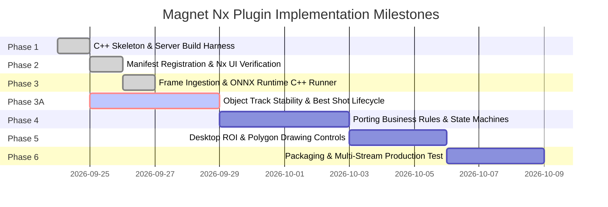

# Magnet AI Vision Analytics — Nx Meta Plugin Implementation Plan

**Author:** Magnet AI Team  
**Platform:** Network Optix MetaVMS (Nx Meta 6.1.2 / `metavms-server`)  
**Target Architecture:** Native C++ In-Process Analytics Plugin (`libmagnet_analytics_plugin.so`)  
**Target Server:** Linux (Ubuntu 20.04 / 22.04 LTS)  
**SDK Package:** `metavms-server_plugin_sdk-6.1.2.42921-universal.zip`  

---

## 1. Executive Summary

This document defines the roadmap for building **Magnet AI Vision Analytics**, a high-performance native C++ analytics plugin for **Network Optix MetaVMS**.

By executing natively inside the `networkoptix-metavms-mediaserver` daemon:
1. **Zero-Copy Performance**: Decoded video frames pass straight from the media engine to inference memory without RTSP re-encoding or network socket latency.
2. **Native Nx Desktop Experience**: Bounding boxes, visitor tracks, queue statistics, and cashier attendance statuses render directly inside the Nx Desktop Client camera view.
3. **Integrated Event Rules**: Triggers Nx native bookmarks, desktop popups, alarms, and push notifications directly through the VMS event bus.
4. **Hardware Efficiency**: Replaces Python runtime overhead and GIL locking with vectorized C++ and multi-threaded ONNX Runtime execution.

---

## 2. System Architecture

```mermaid
graph TD
    subgraph Nx Meta Mediaserver Daemon (Linux)
        RTSP["RTSP Camera Streams"] --> MediaPipeline["Nx Media Engine"]
        MediaPipeline -->|Decoded YUV420 Frames| DeviceAgent["ConsumingDeviceAgent (Per Camera)"]
        
        subgraph Magnet AI Analytics Plugin (libmagnet_analytics_plugin.so)
            Integration["magnet::analytics::Integration<br/>(Manifest & Capabilities)"]
            Engine["magnet::analytics::Engine<br/>(Global Model Cache)"]
            ORT["ONNX Runtime C++ Engine"]
            Engine -->|Manages| ORT
            
            DeviceAgent --> Preproc["Color Conversion & Letterbox"]
            Preproc --> ORT
            ORT --> Postproc["Vectorized NMS & Tracker"]
            Postproc --> StateMachine["Magnet Rule State Machine<br/>(Cashier, Restaurant, Gate)"]
            StateMachine --> MetaPackets["IMetadataPacket & IEventMetadataPacket"]
        end
        
        MetaPackets --> NxStorage["Nx Metadata Engine & Event Bus"]
    end
    
    NxStorage --> NxDesktop["Nx Desktop Client (Live Bounding Boxes, Timeline, Search)"]
```

---

## 3. Brand Identity & Taxonomy in Nx Meta

### Plugin Identification
* **Vendor ID**: `magnet`
* **Vendor Name**: `Magnet`
* **Plugin ID**: `magnet.analytics`
* **Plugin Name**: `Magnet AI Vision Analytics`
* **Library Name**: `libmagnet_analytics_plugin.so`
* **C++ Namespace**: `magnet::analytics`

### Object Types (Taxonomy for Nx Search & Filtering)
| Object Type ID | Display Name | Attributes |
| :--- | :--- | :--- |
| `magnet.person.cashier` | **Magnet: Cashier Staff** | `State` (Attended, Absent), `DwellSeconds` |
| `magnet.person.visitor` | **Magnet: Visitor / Customer** | `Zone` (Queue, Dining, General), `WaitSeconds` |
| `magnet.vehicle` | **Magnet: Audited Vehicle** | `Direction` (Entry, Exit), `Speed` |
| `magnet.plate` | **Magnet: License Plate (ANPR)** | `PlateNumber`, `Confidence` |
| `magnet.animal.horse` | **Magnet: Riding Horse** | `TrackId`, `MotionDirection` |

### Event Types (Nx Event Rules & Alarm Dispatch)
| Event Type ID | Display Name | Trigger Condition |
| :--- | :--- | :--- |
| `magnet.event.cashier_unattended` | **Magnet: Cashier Desk Unattended** | Visitor present at desk with no cashier for > 15s |
| `magnet.event.visitor_unserved` | **Magnet: Customer Waiting Alert** | Customer queue waiting time exceeds threshold (e.g. 60s) |
| `magnet.event.occupancy_exceeded` | **Magnet: Area Capacity Exceeded** | Headcount exceeds dining/zone limit for > 10s |
| `magnet.event.vehicle_entry` | **Magnet: Vehicle Entry Gate Crossing** | Vehicle crosses entry tripwire in forward direction |
| `magnet.event.horse_departure` | **Magnet: Horse Ride Departure** | Horse crosses choke-point tripwire into riding circuit |
| `magnet.event.horse_return` | **Magnet: Horse Ride Return** | Horse crosses choke-point tripwire back into paddock/station |

---

## 4. Phase-by-Phase Roadmap

**Status as of 2026-09-25**: Phases 1-2 complete. Phase 3 delivers detections end-to-end but is
**blocked** on object-track stability (see Phase 3A below and
[ADR-006](file:///c:/Users/Magnet%20Busdev-2/Documents/temp/zoo-monitor/docs/adr/ADR-006-nx-best-shot-ordering-and-inference-clock-track-lifetimes.md)).
Phases 4-6 not started.


```mermaid
gantt
    title Magnet Nx Plugin Implementation Milestones
    dateFormat  YYYY-MM-DD
    section Phase 1
    C++ Skeleton & Server Build Harness   :done, p1, 2026-09-24, 1d
    section Phase 2
    Manifest Registration & Nx UI Verification :done, p2, after p1, 1d
    section Phase 3
    Frame Ingestion & ONNX Runtime C++ Runner  :done, p3, after p2, 1d
    section Phase 3A
    Object Track Stability & Best Shot Lifecycle :active, crit, p3a, 2026-09-25, 4d
    section Phase 4
    Porting Business Rules & State Machines    :p4, after p3a, 4d
    section Phase 5
    Desktop ROI & Polygon Drawing Controls     :p5, after p4, 3d
    section Phase 6
    Packaging & Multi-Stream Production Test  :p6, after p5, 3d
```

> **Note on sequencing**: Phase 3A was not in the original roadmap. Object track identity, track
> lifetimes and Best Shot thumbnails fall between "run inference" (Phase 3) and "apply business
> rules" (Phase 4), so they were built ad hoc and their defects surfaced only in the Nx UI. Phase 4
> depends on stable tracks — a tripwire crossing or a dwell timer is meaningless if track IDs churn
> every frame — so Phase 3A is a hard prerequisite, not a polish pass.

---

### Phase 1: Build Harness & Minimal Plugin Skeleton (MVP) — ✅ COMPLETE
* **Goal**: Generate a minimal `libmagnet_analytics_plugin.so` on the Linux server that compiles cleanly and links against `metavms-server_plugin_sdk`.
* **Tasks**:
  1. Create directory `magnet_nx_plugin/` in this repository.
  2. Write `CMakeLists.txt` supporting both standalone builds (`-DnxSdkDir=...`) and in-tree SDK builds.
  3. Implement `plugin.cpp` exporting `extern "C" NX_PLUGIN_API nx::sdk::IIntegration* createNxPlugin()`.
  4. Write `build_on_server.sh` for one-command compilation on Linux.
* **Verification**:
  * Run `cmake` and `make` on the Linux server.
  * Verify output file exists: `build/libmagnet_analytics_plugin.so`.

---

### Phase 2: Manifest Registration & VMS Discovery — ✅ COMPLETE
* **Goal**: Ensure the plugin loads into `networkoptix-metavms-mediaserver` and appears in the Nx Desktop Client GUI.
* **Tasks**:
  1. Implement `Integration::manifestString()` declaring `magnet.analytics`, vendor, version, and description.
  2. Implement `Engine::manifestString()` specifying `needUncompressedVideoFrames_yuv420`.
  3. Implement `DeviceAgent::manifestString()` declaring supported object and event types.
  4. Copy `.so` to `/opt/networkoptix-metavms/mediaserver/bin/plugins/` and restart server.
* **Verification**:
  * Open Nx Desktop Client -> Camera Settings -> **Plugins** tab.
  * Confirm **"Magnet AI Vision Analytics"** toggle is visible and can be enabled.
  * Check Nx server logs: `tail -f /opt/networkoptix-metavms/mediaserver/var/log/mediaserver.log`.

---

### Phase 3: Video Frame Ingestion & ONNX Runtime C++ — ⚠️ FUNCTIONALLY COMPLETE, SUPERSEDED BY 3A
* **Goal**: Ingest decoded camera frames and run inference with `yolo11s.onnx` or `yolo26s.onnx`.
* **Tasks**:
  1. Download prebuilt **ONNX Runtime C++ Linux x64** library (`libonnxruntime.so`).
  2. Implement `DeviceAgent::pushUncompressedVideoFrame`:
     * Read YUV420 plane buffers from `IUncompressedVideoFrame`.
     * Convert to RGB and resize/letterbox to model resolution (e.g. 640x640 or widescreen 1280x736).
     * Throttle processing to target analytics FPS (e.g., 5 FPS) to conserve server CPU.
  3. Load `.onnx` session in `Engine` (shared across device agents) and run inference.
  4. Implement vectorized NMS (Non-Maximum Suppression) in C++.
     * *Delivered as scalar class-aware NMS in `YoloDetector::postprocess`. Vectorization deferred;
       it is not the bottleneck — see Phase 3A.*
* **Verification**:
  * ~~Verify bounding boxes appear overlaid on live camera stream in Nx Desktop.~~ **Met, but
    insufficient.** This criterion is satisfied by boxes that flicker uselessly, because it says
    nothing about track identity persisting between frames. Superseded by the Phase 3A criteria.

---

### Phase 3A: Object Track Stability & Best Shot Lifecycle — 🚧 IN PROGRESS (BLOCKING)

* **Goal**: Produce object tracks that hold a stable Nx track ID across frames, so overlays stop
  flickering and Best Shot thumbnails render reliably.
* **Context**: Detections are correct; their *identity over time* is not. Greedy IoU matching at
  `kIoUMatchThreshold = 0.3` cannot hold a track when the effective analytics frame rate falls well
  below the configured throttle. For two equal boxes of width `w` offset by `d`,
  `IoU = (w−d)/(w+d)`, so a 0.3 threshold requires displacement under ~54% of box width — which a
  walking person exceeds at ~1.5 FPS. Every miss mints a new track UUID.
* **Tasks**:
  1. **Measure before changing.** Surface per-pass inference latency, effective inference interval,
     `m_droppedFrameCount`, and tracks-created-vs-expired per 30 s. The `try_to_lock` frame drop in
     `pushUncompressedVideoFrame` was silent and is the leading suspect.
     * *🚧 In progress (2026-09-30).* Every ~30 s, each device agent prints one line to the
       mediaserver's stdout. Follow it with
       `journalctl -u networkoptix-metavms-mediaserver -f | grep "Magnet AI Stats"`:
       ```
       [Magnet AI Stats] device=<id> window=30.0s passes=42 rate=1.40/s target=5.00/s infer_avg=612ms infer_max=890ms dropped=180 tracks_created=3 tracks_expired=2 live_tracks=2 best_shots=3
       ```
       * `rate` against `target` is the headline number: the effective inference rate against the
         `kInferenceIntervalUs` throttle.
       * `infer_*` includes any wait on the detector mutex that all cameras share.
       * `dropped` counts frames that passed the throttle but were never inferred, because a
         newer frame replaced them while the worker was busy. So `passes + dropped` ≈
         `target × window`. The first build counted only frame-lock contention and always showed
         0; this was fixed on 2026-09-30.
       * `tracks_created` should be close to the number of objects that entered the scene in the
         window.
     * Observation so far: on Nx testcamera, each object showed up as about **one** record in the
       Objects tab.
     * **First measurement (2026-09-30), DEVELOPMENT server `prsmx`: not representative of
       production.**
       * **Hardware:** 4 vCPUs of an Intel Xeon X5650 (2010, no AVX/AVX2) and no NVIDIA driver.
         ONNX Runtime falls back to its slow SSE kernels on this CPU.
       * **Results:** `yolo11m`, one camera, 2 intra-op threads: `rate=0.39–0.40/s` against
         `target=5.00/s`, `infer_avg≈2.5 s`, and 7–17 tracks created per 30 s.
       * **Effect:** the pass-counted constants stretch about 13×. The Best Shot delay becomes
         ~7.5 s and track expiry ~25 s.
       * **Conclusion:** do **not** use these numbers to decide tasks 2–4. Repeat the measurement
         on production-class hardware (docs/03).
       * **Hardware-independent point:** `YoloDetector::m_inferenceMutex` serializes every camera,
         so per-camera rate = single-camera rate ÷ camera count. At the ~10 cameras in docs/03,
         that needs ~20 ms per pass. That realistically means the GPU, and the plugin is
         CPU-only today, because `build_on_server.sh` fetches the CPU build of ONNX Runtime.
     * **Decision rule once measured:**
       * `rate` near `target` and `tracks_created` ≈ real objects → skip tasks 2–3 on this
         hardware.
       * `rate` well below `target` → do task 2 first.
       * Repeat with two or more cameras before multi-camera rollout, because contention on the
         shared mutex shows up as a higher `infer_avg`.
  2. **Close the cadence gap.** Either raise throughput (`SetIntraOpNumThreads` is pinned at 2;
     consider `yolo11s`/`yolo11n` or a smaller `imgsz`) or set `kInferenceIntervalUs` to the
     measured rate so it stops misrepresenting reality.
  3. **Make matching survive the real cadence.** Lower the IoU threshold and add a
     centroid-distance fallback for when IoU is 0 but the object is plainly the same. IoU alone is
     the wrong tool below ~5 FPS; the Python pipelines use ByteTrack's Kalman prediction at 15 FPS.
  4. **Add track confirmation** — require N consecutive detections before a track is published,
     mirroring `minimum_consecutive_frames` in the `supervision` pipelines.
     * *🚧 Tasks 3–4 implemented, pending on-server verification (2026-09-30), see
       [ADR-007](adr/ADR-007-vendored-bytetrack-per-camera-tracker-toggle.md).*
       * The vendored ByteTrack reference tracker brings Kalman prediction, optimal assignment, a
         low-confidence second association, and two-frame confirmation.
       * It is available per camera through a **"ByteTrack tracking"** switch in Camera Settings →
         Plugins (default off). The IoU tracker is unchanged.
       * Compare the two with `tracker=` in the stats line.
       * Known limit: at low pass rates ByteTrack cannot confirm objects that move more than about
         half their width per pass, so fast cross-traffic stays on IoU.
* **Decision point resolved (2026-09-30):** tasks 3–4 *were* ByteTrack, so it was vendored rather
  than reimplemented (ADR-007). The hybrid architecture stays open if the per-camera results
  disappoint.
  5. **Re-evaluate Best Shots** once tracks are stable. If thumbnails still fail, attach the JPEG
     directly via `setImage("image/jpeg", ...)` to remove the Server's frame-cropping dependency
     (requires a vendored encoder such as `stb_image_write.h`).
     * *✅ Done (2026-09-30).* The remaining missing thumbnails were environmental: recording was
       off on the dev camera. The Server crops rectangle-only Best Shots from the archive. With
       Nx testcamera every record got a thumbnail, and production cameras record continuously, so
       the JPEG option is deferred. See ADR-006, Known Open Items #6.
* **Verification** (replaces the Phase 3 criterion):
  * A stationary object holds a **single** Nx track ID for ≥ 10 seconds continuously.
  * An object occluded for less than the track expiry window keeps its original track ID.
  * Every published track acquires a Best Shot thumbnail within ~1 s, and no thumbnail shows
    background instead of the object.
  * Tracks created per 30 s is within ~2x of the number of real objects that entered the scene.
* **Decision point**: If items 3-4 amount to reimplementing ByteTrack in C++, stop and reconsider
  the architecture. The Python pipelines already carry a tuned tracking stack (ByteTrack +
  `DetectionsSmoother` + containment dedup + temporal median). A hybrid — plugin as a thin metadata
  bridge, Python retaining analytics — is a legitimate outcome of this phase, not a failure.

---

### Phase 4: Porting Domain Rules & State Machines — ❌ NOT STARTED
* **Goal**: Port the Python zoo pipelines to native C++:
  1. **Cashier Presence & Dwell**:
     * Point-in-polygon math for Clerk and Visitor zones.
     * State machine (`ATTENDED`, `UNATTENDED`, `CUSTOMER_WAITING`, `IDLE`).
     * Dwell-time filters (rejecting transient passers-by).
  2. **Restaurant Occupancy**:
     * Dining area polygon filtering + temporal headcount smoothing.
  3. **Vehicle Gate Tripwire**:
     * Line-crossing vector check with ByteTrack trajectory orientation.
* **Verification**:
  * Trigger real events on test videos and confirm native Nx event bookmarks appear on the timeline.

---

### Phase 5: Interactive Nx Desktop ROI Configuration — ❌ NOT STARTED
* **Goal**: Allow operators to draw zones directly in the Nx Desktop Client.
* **Tasks**:
  1. Implement `DeviceAgentSettingsModel` JSON with `PolygonFigure` and `LineFigure`.
  2. Expose interactive UI controls:
     * Clerk Desk Polygon
     * Visitor Queue Polygon
     * Absence Alert Timeout (seconds)
  3. Read user-drawn coordinates dynamically in `DeviceAgent::settingsReceived()`.
* **Verification**:
  * Draw a zone polygon in Nx Desktop camera settings and verify the plugin updates its detection coordinates in real-time.

---

### Phase 6: Packaging, Multi-Stream Optimization & Deployment — ❌ NOT STARTED
* **Goal**: Deploy ready-to-run package for 24/7 park operations.
* **Tasks**:
  1. Add systemd service integration and automated update scripts.
  2. Stress test with 8 simultaneous camera feeds for 24 hours.
  3. Monitor CPU/RAM consumption against Python baseline.
* **Verification**:
  * Zero memory leaks (`valgrind` / ASan clean).
  * System load stays within server budget.

---

## 5. Directory Structure

```
zoo-monitor/
├── docs/
│   └── 06_MAGNET_NX_PLUGIN_IMPLEMENTATION_PLAN.md    <-- This Plan
├── magnet_nx_plugin/
│   ├── CMakeLists.txt                                <-- Build configuration
│   ├── build_on_server.sh                            <-- Server build & deploy automation
│   ├── plugin.cpp                                    <-- Entry point (createNxPlugin)
│   ├── src/
│   │   ├── integration.h                             <-- Plugin Manifest
│   │   ├── integration.cpp
│   │   ├── engine.h                                  <-- Inference & Model Cache
│   │   ├── engine.cpp
│   │   ├── device_agent.h                            <-- Per-Camera Analytics Worker
│   │   ├── device_agent.cpp
│   │   └── settings_model.h                          <-- Nx Desktop UI ROI Model
│   └── README.md                                     <-- Server setup instructions
```
