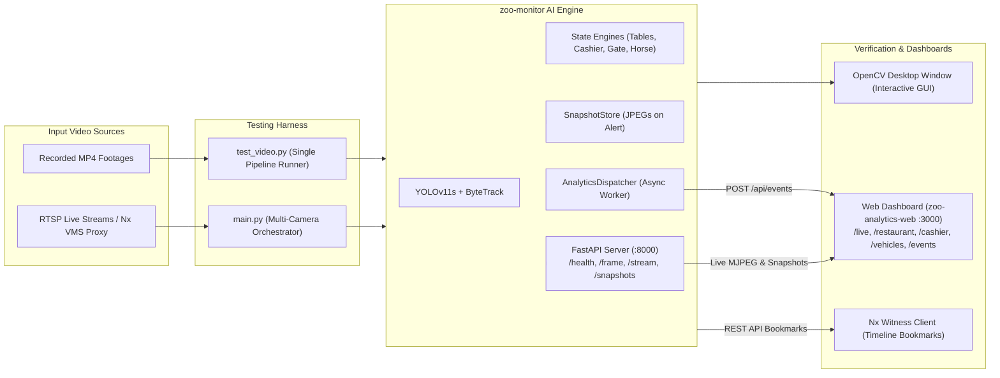

# Comprehensive Testing & Verification Guide

This guide provides end-to-end testing instructions for the **Zoo & Safari Computer Vision System** (`zoo-monitor`) and its integration with the **Web Analytics Dashboard** (`zoo-analytics-web`) and **Network Optix MetaVMS**.

---

## 📋 Table of Contents
1. [Overview & Testing Architecture](#1-overview--testing-architecture)
2. [Quick Sanity Checks (Smoke Tests)](#2-quick-sanity-checks-smoke-tests)
3. [Testing with Recorded MP4 Footage (`test_video.py`)](#3-testing-with-recorded-mp4-footage-test_videopy)
4. [5 Use Cases Testing Command Matrix](#4-5-use-cases-testing-command-matrix)
5. [End-to-End Testing with Web Dashboard (`zoo-analytics-web`)](#5-end-to-end-testing-with-web-dashboard-zoo-analytics-web)
6. [Interactive GUI Controls & Coordinate Calibration](#6-interactive-gui-controls--coordinate-calibration)
7. [Testing the Embedded AI API Engine (`:8000`)](#7-testing-the-embedded-ai-api-engine-8000)
8. [Common Troubleshooting & Gotchas](#8-common-troubleshooting--gotchas)

---

## 1. Overview & Testing Architecture



---

## 2. Quick Sanity Checks (Smoke Tests)

### Test Synthetic Detections (No Camera / No MP4 Needed)
Verifies that PyTorch, ByteTrack, and the rules engine run without errors:
```powershell
# From zoo-monitor directory with virtual environment activated:
python test_synthetic_demo.py
```
* **Expected Output**: A simulated cashier test running 30 synthetic frames, detecting presence, state changes, and completing with `[PASS]`.

---

## 3. Testing with Recorded MP4 Footage (`test_video.py`)

[`test_video.py`](file:///c:/Users/Magnet%20Busdev-2/Documents/temp/zoo-monitor/test_video.py) is the primary diagnostic utility for evaluating AI vision models and state machines on real recorded footage.

### Basic Syntax
```powershell
python test_video.py --video <PATH_TO_MP4> --pipeline <PIPELINE_NAME> [OPTIONS]
```

### Key Command Line Arguments

| Argument | Description | Default |
|---|---|---|
| `--video` | **(Required)** Path to input `.mp4` video file | None |
| `--pipeline` | Vision pipeline to run: `gate`, `cashier`, `restaurant`, `restaurant_table`, `horse` | `horse` |
| `--start-time` | Start offset in `MM:SS` (e.g. `26:50`) or total seconds (`1610`) | `00:00` |
| `--duration` | Process only a specific window in seconds (e.g. `60` or `1:30`) | Entire video |
| `--analytics` | **Connect to Web Dashboard**: Spins up FastAPI (:8000), saves event snapshots, and posts events to `:3000` | `False` |
| `--infer-fps` | Target inference cadence (e.g. `2` for 2 inferences/sec, or `15.5` for full speed) | Native video FPS |
| `--save-output` | Export processed video with bounding boxes and HUD to an `.mp4` file | None |
| `--hide-boxes` | Clean executive presentation HUD (hides raw bounding boxes and tracking IDs) | `False` |
| `--show-boxes` | Force display all bounding boxes, track IDs, and confidence tags | Default in debug |
| `--no-gui` | Headless execution (does NOT open an OpenCV window; ideal for automated testing) | `False` (GUI is ON) |
| `--no-anpr` | Disable OCR / license plate recognition for vehicle gate pipeline | `False` |

---

## 4. 5 Use Cases Testing Command Matrix

### Use Case 1: Vehicle Gate & License Plate Recognition (ANPR)
```powershell
# Interactive GUI test with ANPR:
python test_video.py --video "sample_data/cars.mp4" --pipeline gate --infer-fps 10

# Push gate telemetry & vehicle counts to web dashboard:
python test_video.py --video "sample_data/cars.mp4" --pipeline gate --infer-fps 10 --analytics
```
* **What to verify**: Direction tripwire crossing (IN / OUT count) and Indonesian license plate OCR box in the HUD.

---

### Use Case 2: Cashier Desk Presence & Queue Monitoring
```powershell
# Interactive GUI test:
python test_video.py --video "sample_data/kasir.mp4" --pipeline cashier --infer-fps 5

# Connect to web dashboard:
python test_video.py --video "sample_data/kasir.mp4" --pipeline cashier --infer-fps 5 --analytics
```
* **What to verify**:
  - `CLERK PRESENT` (Green) when teller is seated in `clerk_zone`.
  - `UNATTENDED` (Red) when teller leaves while customer waits in `visitor_zone`.
  - Dispatches `cashier_unattended` or `customer_waiting` alerts after debounce timeout.

---

### Use Case 3: Restaurant Capacity & Dining Hall Headcount
```powershell
# Test dining hall occupancy starting at timestamp 26:50:
python test_video.py --video "C:/Users/Magnet Busdev-2/Downloads/restoran.mp4" --pipeline restaurant --start-time 26:50 --infer-fps 15 --analytics
```
* **What to verify**:
  - Top-left HUD card displaying live smoothed occupancy vs. Warning Limit (45) and Max Capacity (60).
  - Web dashboard at `http://localhost:3000/restaurant` shows live occupancy curve.

---

### Use Case 4: Dining Table Occupancy & Dwell Time (Status Meja)
```powershell
# Run the dedicated multi-table pipeline with dashboard sync:
python test_video.py --video "C:/Users/Magnet Busdev-2/Downloads/restoran.mp4" --pipeline restaurant_table --start-time 26:50 --infer-fps 15 --analytics
```
* **What to verify**:
  - 9 dining table polygons rendered on frame (Green = `EMPTY`, Red = `OCCUPIED`).
  - Table badges show seating count and live dwell timer (e.g. `T1 [3p] 04:12`).
  - Web dashboard `Status Meja` grid updates table states and average guest stay length.

---

### Use Case 5: Horse-Riding Attraction Tracking
```powershell
# Interactive test:
python test_video.py --video "sample_data/kuda.mp4" --pipeline horse --infer-fps 10 --analytics
```
* **What to verify**:
  - Choke-point tripwire counts horse departures and returns.
  - Active horses on track calculation.

---

## 5. End-to-End Testing with Web Dashboard (`zoo-analytics-web`)

### Step 1: Start Web Dashboard
In a terminal window:
```powershell
cd c:\Users\Magnet Busdev-2\Documents\temp\zoo-analytics-web
npm run dev     # Or: npm start
```
Verify the dashboard is accessible at `http://localhost:3000`.

### Step 2: Configure Environment in `zoo-analytics-web`
Create or verify `.env.local` inside `zoo-analytics-web`:
```env
# URL of zoo-monitor AI engine API
AI_ENGINE_URL=http://127.0.0.1:8000
```

### Step 3: Run Video Pipeline with `--analytics`
In a second terminal window:
```powershell
cd c:\Users\Magnet Busdev-2\Documents\temp\zoo-monitor
.\.venv\Scripts\Activate.ps1
python test_video.py --video "C:/Users/Magnet Busdev-2/Downloads/restoran.mp4" --pipeline restaurant --start-time 26:50 --infer-fps 15 --analytics
```

### Step 4: Verify Dashboard Pages
1. **Live Camera Page (`http://localhost:3000/live`)**:
   - You should see the active camera card with status `ONLINE` and current inference FPS.
   - The still image auto-refreshes every 2 seconds.
   - **Click the camera tile**: An interactive modal pops up showing real-time 5 FPS MJPEG video streaming directly from Python!
2. **Restaurant Page (`http://localhost:3000/restaurant`)**:
   - Current seated guests, peak occupancy, and time spent above warning threshold.
   - **Status Meja Grid**: Individual cards for each dining table showing `EMPTY` / `OCCUPIED`, guest count, dwell time, and average turnover time.
3. **Event Log & Snapshots (`http://localhost:3000/events`)**:
   - Filter events by camera or use case.
   - Click any thumbnail in the **Bukti** (Evidence) column to open the full-resolution annotated snapshot captured at the exact moment of the alert.

---

## 6. Interactive GUI Controls & Coordinate Calibration

When running `test_video.py` with GUI enabled:

### Keyboard Shortcuts
* <kbd>SPACE</kbd>: Pause / Resume playback.
* <kbd>d</kbd> or <kbd>→</kbd>: Fast-forward +10 seconds.
* <kbd>a</kbd> or <kbd>←</kbd>: Rewind -10 seconds.
* <kbd>p</kbd>: Toggle ANPR (gate pipeline only).
* <kbd>q</kbd>: Quit test runner cleanly.

### Live Coordinate Calibration Mode
For pipelines using tripwires (`gate`, `horse`):
1. Click on the video window to set **Point 1 (Start)**.
2. Click a second location to set **Point 2 (End)**.
3. The terminal logs the normalized coordinates `[x, y]` and **immediately updates the tripwire in real-time** without restarting!

---

## 7. Testing the Embedded AI API Engine (`:8000`)

When running with `--analytics` or via `main.py`, the AI engine runs a lightweight FastAPI service:

| Endpoint | Method | Description | Test Command |
|---|---|---|---|
| `/health` | `GET` | List active cameras, online status, and FPS | `curl http://127.0.0.1:8000/health` |
| `/frame/{cam_id}` | `GET` | Return single latest annotated JPEG frame | Open `http://127.0.0.1:8000/frame/cam_restaurant_test` in browser |
| `/stream/{cam_id}` | `GET` | On-demand 5 FPS MJPEG stream | Open `http://127.0.0.1:8000/stream/cam_restaurant_test` in browser |
| `/snapshots/{path}` | `GET` | Retrieve saved event snapshot JPEG | `http://127.0.0.1:8000/snapshots/<cam>/<date>/<event_id>.jpg` |

---

## 8. Common Troubleshooting & Gotchas

### Issue 1: "Could not open GUI window. Running in headless mode"
* **Cause**: `opencv-python-headless` is installed or has shadowed `opencv-python`.
* **Fix**: Ensure only full `opencv-python` is installed:
  ```powershell
  pip uninstall -y opencv-python-headless
  pip install --force-reinstall --no-deps opencv-python
  ```

### Issue 2: "Mesin AI belum terhubung" in Web Dashboard `/live`
* **Cause**: `AI_ENGINE_URL` is missing from `zoo-analytics-web/.env.local`, or `test_video.py` was started without `--analytics`.
* **Fix**: 
  1. Add `AI_ENGINE_URL=http://127.0.0.1:8000` to `zoo-analytics-web/.env.local`.
  2. Restart the web dashboard (`npm run dev` or `npm start`).
  3. Ensure `test_video.py` includes the `--analytics` flag.

### Issue 3: Video plays too fast or too slow
* **Cause**: Default processing runs as fast as CPU/GPU can decode.
* **Fix**: Specify `--infer-fps <number>` (e.g. `--infer-fps 15` or `--infer-fps 5`) to match real-time camera speed.

### Issue 4: Running on Headless / Remote Server (No Display)
* **Fix**: Add `--no-gui` to suppress the OpenCV window and run purely as a headless background daemon:
  ```powershell
  python test_video.py --video sample.mp4 --pipeline restaurant --no-gui --analytics
  ```
