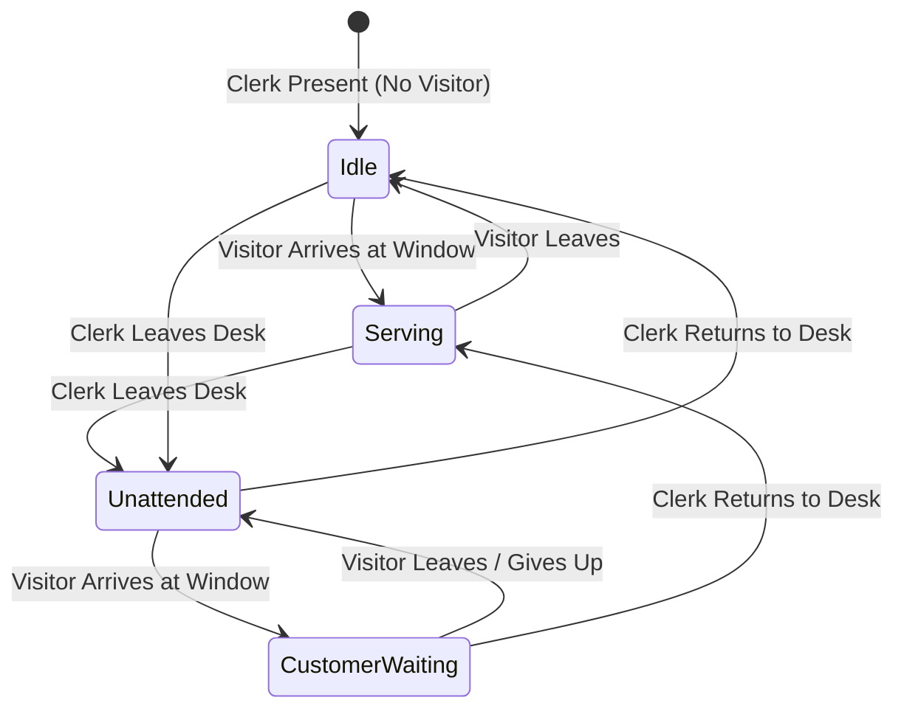

# ADR-002: Cashier Dual-Zone Presence and Customer Queue Monitoring

* **Status**: Accepted
* **Date**: 2026-09-23
* **Deciders**: Computer Vision Engineering Team
* **Technical Domain**: Computer Vision Analytics, Event Dispatching

---

## Context and Problem Statement
Phase 1 requirements originally defined Cashier Monitoring as a single-zone presence check: trigger an alert when the cashier desk is empty for $> X$ seconds.
However, empirical analysis on the physical ticket booth video (`kasir.mp4`) revealed critical operational gaps:
1. **False Attendance from Customers**: Customers standing outside the ticket window glass occupy the same 2D vertical coordinate range as the cashier. A single large ROI causes a customer waiting at an empty booth to be misclassified as "Cashier Present".
2. **Lack of Service Context**: Management cannot distinguish whether a booth is:
   - Actively serving customers.
   - Attended by staff but idle (no visitors).
   - Empty during slow periods (acceptable short break).
   - Empty while visitors are actively waiting at the window (critical service SLA violation).

---

## Decision Drivers
* **Customer Service SLA**: Immediately alert supervisors when visitors are waiting at an unattended window.
* **Separation of Concerns**: Clearly distinguish staff presence from visitor presence.
* **Audit Trail in Nx Witness**: Create clear, tagged timeline bookmarks for compliance and performance auditing.

---

## Decision Outcome
**Chosen Architecture**: **Dual-Zone Detection with a 4-State Machine**.

### 1. Zone Definitions
* **`clerk_zone`**: Tightly wraps the cashier chair and behind-the-counter space:
  - Normalized: `[[0.33, 0.46], [0.72, 0.46], [0.72, 1.00], [0.33, 1.00]]`
  - Anchors: `[sv.Position.CENTER, sv.Position.BOTTOM_CENTER]`
* **`visitor_zone`**: Tightly wraps the queue space directly facing the service window:
  - Normalized: `[[0.36, 0.12], [0.64, 0.12], [0.64, 0.46], [0.36, 0.46]]`
  - Anchors: `[sv.Position.CENTER, sv.Position.BOTTOM_CENTER]`

### 2. Operational States Matrix
| State | Clerk Present? | Visitor Present? | Visual Indicator | Nx Meta Dispatch |
| :--- | :---: | :---: | :--- | :--- |
| **`SERVING CUSTOMER`** | YES | YES | Sky Blue Banner | Normal operation |
| **`CASHIER PRESENT (IDLE)`** | YES | NO | Green Banner | Normal operation (ready for guests) |
| **`DESK UNATTENDED (Xs)`** | NO | NO | Orange / Red Banner | `#cashier_unattended` bookmark after `absence_alert_timeout_sec` (10s) |
| **`ALERT: CUSTOMER WAITING (Xs)`** | NO | YES | Flashing Red Banner | **`[URGENT] Customer Waiting at Unattended Desk`** bookmark & popup event after `visitor_waiting_alert_timeout_sec` (5s) |

---

## Consequences

### Positive:
* **Elimination of False Positives**: Customers outside the glass window can never falsely trigger the cashier desk as attended.
* **Targeted Escalation**: High-priority alert dispatched only when customer service is actively blocked by staff absence.
* **Rich Diagnostic UI**: Top banner displays real-time clerk and visitor headcount alongside state and elapsed timers.

### Negative:
* Slightly higher computation overhead due to two `PolygonZone.trigger()` evaluations per frame (measured at $< 0.1$ms on CPU, effectively negligible).

---

## Validation
* Tested against keyframes `01:28` (clerk + visitor), `15:28` (clerk alone), `16:15` (clerk stepped away), and `29:48` (customer waiting without clerk). All 4 states transitioned and triggered correctly.
