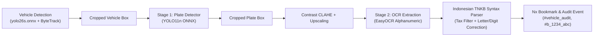

# ADR-005: Indonesian License Plate Recognition (ANPR / LPR) for Vehicle Gateway Audit

* **Status**: Accepted
* **Date**: 2026-09-24
* **Deciders**: Computer Vision Engineering Team
* **Technical Domain**: Vehicle Gateway Pipeline, ANPR/LPR, OCR, Indonesian TNKB Standard

---

## Context and Problem Statement

The vehicle gateway pipeline previously detected vehicle classes (`car`, `motorcycle`, `bus`, `truck`) and line-crossing direction (`ENTRY` / `EXIT`), but lacked vehicle identity identification (License Plate Numbers). 

For municipal parking revenue audits (such as UP Perparkiran DKI Jakarta) and automated zoo entrance auditing, recording vehicle volume without license plates prevents automated cross-referencing against POS ticketing databases and leaves revenue leakage unaddressed.

---

## Architecture & Implementation

We implemented a 2-stage lightweight ANPR engine in [`core/anpr_engine.py`](file:///c:/Users/Magnet%20Busdev-2/Documents/temp/zoo-monitor/core/anpr_engine.py):

### Key Technical Innovations:

1. **YOLO11 ONNX Plate Detector**:
   - Model: `models/license_plate_detector.onnx` (10.4 MB).
   - Runs on CPU with ONNX Runtime to maintain lean memory footprint and zero external C++ runtime dependencies.
2. **Indonesian TNKB Standard Parser**:
   - Standard format: `[1-2 Letters Area Code] [1-4 Digits Registration] [1-3 Letters Suffix]`.
   - Validates against all 34 official Indonesian Traffic Police (Korlantas Polri) regional codes (`B`, `D`, `DK`, `BK`, `AD`, etc.).
3. **Tax Expiration Stamp Filtering**:
   - Indonesian plates print an expiration stamp below the main number (e.g. `08.29`).
   - The engine automatically filters out text detected in the lower 25% of the plate height, preventing false suffix digits.
4. **Context-Aware Character Confusion Correction**:
   - Letters in Prefix & Suffix: Automatically resolves OCR confusion (`0` &rarr; `D`, `8` &rarr; `B`, `1` &rarr; `I`, `5` &rarr; `S`).
   - Digits in Registration: Automatically maps (`O/D` &rarr; `0`, `B` &rarr; `8`, `I/L` &rarr; `1`, `S` &rarr; `5`, `Z` &rarr; `2`).
5. **Persistent Track Cache**:
   - ByteTrack maintains a consistent `tracker_id`. Once a high-confidence, valid plate is acquired, it is cached for the lifetime of that vehicle track, avoiding redundant OCR calls per frame.

---

## Decision Outcome

* **Model**: `models/license_plate_detector.onnx` + `EasyOCR` + Indonesian TNKB Syntax Engine.
* **Nx Integration**: Bookmarks emitted with format `[GATE AUDIT] Vehicle ENTRY - CAR (B 1234 ABC)` with clean tags `#b_1234_abc`.
