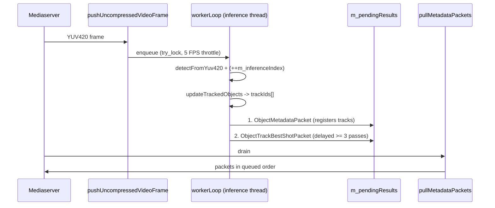

# ADR-006: Nx Best Shot Emission Ordering & Inference-Clock Track Lifetimes

* **Status**: Accepted
* **Date**: 2026-09-25
* **Deciders**: Computer Vision Engineering Team
* **Technical Domain**: Magnet Nx MetaVMS C++ Plugin, Object Track Metadata, Best Shot Thumbnails

---

## Context and Problem Statement

After wiring ONNX Runtime inference into the native plugin ([`magnet_nx_plugin/`](file:///c:/Users/Magnet%20Busdev-2/Documents/temp/zoo-monitor/magnet_nx_plugin)), bounding boxes rendered correctly in the Nx Desktop Client, but **object thumbnails in the right-side panel appeared only intermittently**, and some that did appear showed background instead of the detected object.

No error was logged by either the plugin or `networkoptix-metavms-mediaserver`. The Server discards a malformed or unattachable Best Shot silently, so the failure was invisible from logs and only observable as missing thumbnails in the UI.

Three independent defects were identified in [`src/device_agent.cpp`](file:///c:/Users/Magnet%20Busdev-2/Documents/temp/zoo-monitor/magnet_nx_plugin/src/device_agent.cpp):

1. **Inverted packet order.** `IObjectTrackBestShotPacket` was queued into the results buffer *before* the `ObjectMetadataPacket` that registers the track. A Best Shot naming a track the Server has not yet registered is dropped.
2. **No settling delay.** A Best Shot was emitted on the very first inference pass in which a track existed, racing the Server's own track registration. Whether the thumbnail survived depended on timing — the direct cause of the intermittency.
3. **Stale bounding boxes.** Best Shots were emitted for *every* live track, including tracks not matched in the current pass. This paired a bounding box from an earlier frame with the current frame's timestamp, so the Server cropped a region the object had already left.

A fourth, latent defect compounded these: track lifetimes were counted in **pushed frames** while tracking only advances on **inference passes**. At a 5 FPS inference throttle on a 25 FPS stream, `kTrackExpiryFrames = 30` was ~1 second of wall time but only ~5 tracking updates — aggressive enough to expire tracks during ordinary occlusions, and directly in conflict with any frame-counted Best Shot delay.

### Reference Behaviour in the Nx SDK

The contract is not stated in prose in the SDK documentation; it is expressed in the reference implementation. In `samples/analytics/stub_analytics_plugin/.../best_shots_and_titles/device_agent.cpp`:

```cpp
if (m_generateBestShot)
{
    generateBestShotObject();                                   // object metadata packet FIRST
    std::vector<Ptr<IObjectTrackBestShotPacket>> bestShotPackets = generateBestShots();
    for (Ptr<IObjectTrackBestShotPacket>& p: bestShotPackets)
        pushMetadataPacket(p);                                  // Best Shot AFTER
}
```

The sample additionally arms a per-track countdown (`m_bestShotGenerationCounterByTrackId[trackId] = frameNumberToGenerateBestShot`) and emits the Best Shot only once it reaches zero — never on a track's first frame. Both behaviours are load-bearing, not incidental.

---

## Architecture & Implementation



### Decisions

1. **Object metadata precedes Best Shots within a single results batch.**
   `workerLoop` now builds one ordered `std::vector<Ptr<IMetadataPacket>> outgoing`, pushes the object packet first, appends Best Shots, then transfers the whole batch under `m_resultsMutex`. Because `pullMetadataPackets` preserves queue order, the Server always sees the track before its thumbnail.

2. **Best Shots are gated on confirmation in the current pass.**
   `collectBestShotPackets` skips any track whose `lastSeenInference != m_inferenceIndex`, guaranteeing the bounding box describes the frame at the emitted timestamp.

3. **A Best Shot is withheld for `kBestShotDelayInferences` (3) passes after track creation.**
   ~0.6 s at the 5 FPS throttle. This removes the race rather than narrowing it.

4. **All track lifetimes are counted in inference passes, not pushed frames.**
   A worker-thread-owned `m_inferenceIndex` replaces `m_frameIndex` inside the tracker. `kTrackExpiryInferences = 10` (~2 s at 5 FPS) supersedes `kTrackExpiryFrames = 30`. The two clocks are now explicit and independent: `m_frameIndex` remains the Server-thread frame counter, `m_inferenceIndex` the tracking clock.

5. **`updateTrackedObjects` returns track Uuids positionally aligned with its input detections.**
   The previous implementation re-derived each detection's track by comparing four `float` members for exact equality, with a `randomUuid()` fallback. That fallback would have produced a fresh track per frame had the invariant ever broken — silently destroying both overlays and thumbnails. A null `Uuid` in the returned vector now means "no Nx object type, do not report", checked via `Uuid::isNull()`.

### Verified Against SDK 6.1.2.42921

Confirmed by reading the vendored SDK at [`metavms-server_plugin_sdk-6.1.2.42921-universal/`](file:///c:/Users/Magnet%20Busdev-2/Documents/temp/zoo-monitor/metavms-server_plugin_sdk-6.1.2.42921-universal):

| Item | Source | Result |
| :--- | :--- | :--- |
| Entry point `createNxPlugin()` returning `IIntegration*` | `src/nx/sdk/entry_points.h:32` | Correct as written |
| `ObjectTrackBestShotPacket(Uuid, int64_t, Rect)` | `src/nx/sdk/analytics/helpers/object_track_best_shot_packet.h` | Correct as written |
| Best Shot timestamp must be positive | `src/nx/sdk/analytics/i_object_track_best_shot_packet.h` | Satisfied — uses `frame->timestampUs()` |
| `Ptr<IMetadataPacket>` may hold a Best Shot packet | `i_metadata_packet.h:18` (`using IMetadataPacket0 = IMetadataPacket`) | Type-correct |
| Emission order | `stub_analytics_plugin/.../best_shots_and_titles/device_agent.cpp:151-155` | Was inverted; now fixed |

---

## Decision Outcome

* **Thumbnail correctness is a function of packet *order* and *timing*, not packet content.** Both are now encoded as invariants with comments stating why, because neither is enforced by the compiler and both fail silently.
* **Two clocks, named separately.** Any future throttle change (`kInferenceIntervalUs`) rescales `kTrackExpiryInferences` and `kBestShotDelayInferences` together and coherently; a frame-counted budget would have silently drifted.

### Accepted Trade-offs

* A thumbnail now appears ~0.6 s after an object is first detected rather than immediately.
* **Tracks shorter than 3 inference passes (~0.6 s) never receive a thumbnail.** Acceptable: such tracks are transient detections, and for the horse-riding revenue count the ride audit is driven by tripwire crossings, not thumbnails.
* Inference remains serialized across all cameras by `YoloDetector::m_inferenceMutex`. Out of scope here; revisit before multi-camera rollout.

### Verification Criteria (pending on-server confirmation)

Static review and SDK cross-checks are complete; the following has **not** yet been observed on `metavms-server`:

1. Every tracked object acquires a thumbnail within ~1 s and none show background.
2. Thumbnails persist across an occlusion shorter than `kTrackExpiryInferences`.
3. No duplicate-track proliferation in the Nx object panel over a 10-minute run.

### Known Open Items (not addressed by this ADR)

1. `pushUncompressedVideoFrame` emits `magnet.event.cashier_unattended` every 300 frames as a heartbeat, on **every** camera. Any Nx alarm rule bound to that type will fire continuously. Needs a dedicated diagnostic event type or removal.
2. No `deviceAgentSettingsModel`, so zones and tripwires cannot be drawn in Nx Desktop. `PolygonFigure` / `LineFigure` (`src/nx/sdk/settings_model.md:416,485`) are the intended mechanism — see `docs/06` Phase 5.
3. `build_on_server.sh` SDK-zip extraction still assumes a `server_plugin_sdk/` top-level folder, and restarts the mediaserver without confirmation.
4. `pushCompressedVideoFrame` still increments `m_frameIndex`, double-counting if both stream types are delivered.
5. `setIsActive(true)` is never followed by `false` on prolonged events.
