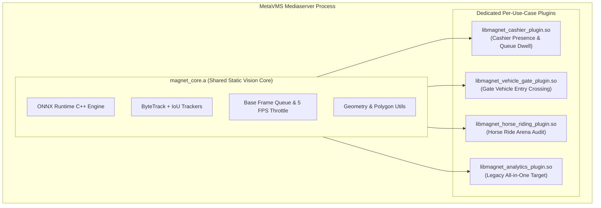

# 🧲 Magnet AI Vision Analytics — Nx Meta Plugins

Modular native C++ Analytics Plugins for **Network Optix MetaVMS** (`metavms-server`), branded for **Magnet**.

> **Status: frozen prototype.** Kept for a future Nx bridge that forwards the Python engine's boxes and
> events to Nx (see `docs/superpowers/specs/2026-10-08-zoo-vision-production-architecture-design.md`,
> section 6). No changes until that bridge gets its own spec. It is not built in CI.
>
> **SDK:** built against Nx Meta Server Plugin SDK **6.1.2.42921**
> (`metavms-server_plugin_sdk-6.1.2.42921-universal`). Pass its `server_plugin_sdk` folder with
> `-DnxSdkDir=...` (CMake), `NX_SDK_DIR=...` or as the first argument of `build_on_server.sh`.

---

## Architecture Overview



### Available Plugins

1. **Magnet Cashier & Counter Analytics (`libmagnet_cashier_plugin.so`)**:
   - **Plugin ID**: `magnet.analytics.cashier`
   - **Supported Objects**:
     - `magnet.person.cashier` — Cashier Desk Staff
     - `magnet.person.visitor` — Customer / Queue Member
   - **Supported Events**:
     - `magnet.event.cashier_unattended` — Cashier Desk Unattended Alert (configurable delay)
     - `magnet.event.visitor_unserved` — Customer Waiting Alert (configurable queue dwell threshold)
   - **GUI Settings (Nx Desktop Camera Settings -> Plugins)**:
     - `cashierZone`: Interactive polygon drawn over cashier staff desk
     - `queueZone`: Interactive polygon drawn over customer waiting line
     - `unattendedThresholdSec`: Seconds before unstaffed alert triggers (default: 15s)
     - `waitingThresholdSec`: Seconds before customer waiting alert triggers (default: 30s)
     - `useByteTrack`: Toggle ByteTrack motion prediction vs greedy IoU (default: ON)

2. **Magnet AI Vision Analytics (`libmagnet_analytics_plugin.so`)**:
   - Monolithic all-in-one target maintained for backward compatibility.

---

## How to Build & Deploy on the Linux Server

### 1. Copy Files to the Server

From your development machine, copy this `integrations/nx/plugin/` folder (it arrives as `~/plugin`), the SDK zip archive, and your exported ONNX model (`yolo11s.onnx` or `yolo11m.onnx`) to your Linux server (e.g., `172.31.254.130`):

```bash
scp -r integrations/nx/plugin/ yolo11s.onnx user@172.31.254.130:~/
```

### 2. Run the One-Command Build Script

On your Linux server:

```bash
cd ~/plugin
chmod +x build_on_server.sh
./build_on_server.sh --restart
```

The script will automatically:
1. Verify / install `cmake`, `g++`, `make`, `libeigen3-dev`, `wget`, `tar`, and `unzip`.
2. Extract the Nx Meta SDK if needed.
3. Automatically download and configure **ONNX Runtime C++ Linux x64 (v1.18.0)**.
4. Compile `magnet_core` static library and output:
   - `libmagnet_cashier_plugin.so`
   - `libmagnet_analytics_plugin.so`
5. Deploy all `.so` binaries and `libonnxruntime.so` to `/opt/networkoptix-metavms/mediaserver/bin/plugins/`.
6. Deploy `yolo11s.onnx` to `/opt/networkoptix-metavms/mediaserver/bin/plugins/models/`.
7. Reload / restart `networkoptix-metavms-mediaserver`.

---

## Verifying in Nx Desktop Client

1. Open your **Nx Desktop Client** connected to the server.
2. Right-click your cashier camera -> select **Camera Settings**.
3. Go to the **Plugins** tab.
4. You will see **"Magnet: Cashier & Counter Analytics"**.
5. Toggle the plugin **ON**.
6. Draw your **Cashier Desk Area** polygon and **Customer Queue Area** polygon directly on the camera preview.
7. Click **Apply**! Live bounding boxes will appear with green/blue boxes distinguishing cashiers from visitors, and unstaffed alerts will appear in the notification panel when the desk is empty.

---

## Directory Structure

```
integrations/nx/plugin/
├── CMakeLists.txt              # Unified root build configuration
├── build_on_server.sh          # One-command server build & deploy script
├── README.md                   # This guide
├── tests/
│   └── tracker_compare.cpp     # Tracker benchmark test
│
├── core/                       # Shared C++ Static Library (target: magnet_core)
│   ├── CMakeLists.txt
│   ├── detection.h             # Detection record shared across plugins
│   ├── tracker.h               # Generic tracker interface
│   ├── iou_tracker.h/.cpp      # Greedy IoU tracker
│   ├── byte_track_tracker.h/.cpp # ByteTrack adapter
│   ├── third_party/bytetrack/  # Vendored ByteTrack
│   ├── yolo_detector.h/.cpp    # ONNX Runtime YOLO inference engine
│   ├── geometry_utils.h/.cpp   # Point-in-polygon & tripwire crossing utils
│   ├── base_engine.h/.cpp      # Engine model discovery & lifecycle base
│   └── base_device_agent.h/.cpp # Frame ingestion, 5 FPS throttle, Best Shots
│
├── plugins/
│   └── cashier/                # Target: libmagnet_cashier_plugin.so
│       ├── CMakeLists.txt
│       ├── plugin.cpp          # Nx entry point (createNxPlugin)
│       ├── cashier_manifest.h  # Manifest & GUI settings schema
│       ├── cashier_engine.h/.cpp
│       ├── cashier_device_agent.h/.cpp
│       └── cashier_integration.h/.cpp
│
└── src/                        # Legacy all-in-one plugin sources
    ├── integration.h/.cpp
    ├── engine.h/.cpp
    └── device_agent.h/.cpp
```
