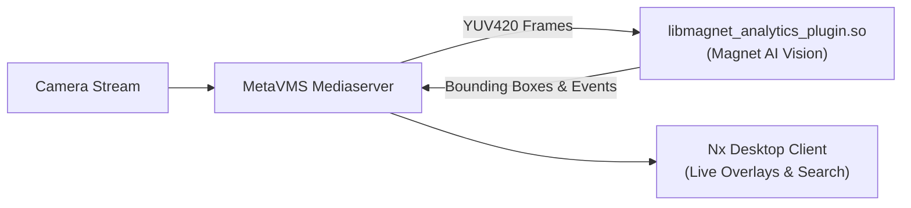

# 🧲 Magnet AI Vision Analytics — Nx Meta Plugin

A native C++ Analytics Plugin (`libmagnet_analytics_plugin.so`) for **Network Optix MetaVMS** (`metavms-server`), branded for **Magnet**.

---

## Architecture Overview



* **Plugin ID**: `magnet.analytics`
* **Vendor**: `Magnet`
* **Plugin Name**: `Magnet AI Vision Analytics`
* **Supported Objects**:
  * `magnet.person.cashier` — Magnet: Cashier Staff
  * `magnet.person.visitor` — Magnet: Visitor / Queue Member
  * `magnet.vehicle` — Magnet: Audited Vehicle
  * `magnet.plate` — Magnet: License Plate (ANPR)
  * `magnet.animal.horse` — Magnet: Riding Horse
* **Supported Events**:
  * `magnet.event.cashier_unattended` — Cashier Desk Unattended Alert
  * `magnet.event.visitor_unserved` — Customer Waiting Alert
  * `magnet.event.occupancy_exceeded` — Area Capacity Exceeded
  * `magnet.event.vehicle_entry` — Gate Vehicle Entry Crossing
  * `magnet.event.horse_departure` — Horse Ride Departure Audit
  * `magnet.event.horse_return` — Horse Ride Return Audit

---

## How to Build & Deploy on the Linux Server

### 1. Copy Files to the Server

From your development machine, copy this `magnet_nx_plugin/` folder and the SDK zip archive to your Linux server (e.g., `172.31.254.130`):

```bash
# Using SCP (replace user and server IP with your credentials)
scp -r magnet_nx_plugin/ "C:/Users/Magnet Busdev-2/Downloads/metavms-server_plugin_sdk-6.1.2.42921-universal.zip" user@172.31.254.130:~/
```

### 2. Run the One-Command Build Script

On your Linux server:

```bash
cd ~/magnet_nx_plugin
chmod +x build_on_server.sh
./build_on_server.sh
```

The script will automatically:
1. Verify / install `cmake`, `g++`, `make`, and `unzip`.
2. Extract the Nx Meta SDK if needed.
3. Compile `libmagnet_analytics_plugin.so`.
4. Copy the `.so` binary to `/opt/networkoptix-metavms/mediaserver/bin/plugins/`.
5. Restart `networkoptix-metavms-mediaserver`.

---

## Verifying in Nx Desktop Client

1. Open your **Nx Desktop Client** connected to the server.
2. Right-click any camera -> select **Camera Settings**.
3. Go to the **Plugins** tab.
4. You will see **"Magnet AI Vision Analytics"** with vendor **"Magnet"**.
5. Toggle the plugin **ON** and click **Apply**.
6. View the camera tile: you will see the live circulating demo bounding box and periodic test events on the right-side notification panel!

---

## Directory Structure

```
magnet_nx_plugin/
├── CMakeLists.txt         # CMake build configuration
├── build_on_server.sh     # One-command server build & deploy script
├── plugin.cpp             # Nx 6.1 entry point (createNxPlugin)
├── README.md              # This guide
└── src/
    ├── integration.h      # Plugin Manifest & Metadata
    ├── integration.cpp
    ├── engine.h           # Engine singleton & frame capabilities
    ├── engine.cpp
    ├── device_agent.h     # Per-stream analytics worker
    └── device_agent.cpp   # Frame ingestion & metadata packets
```
