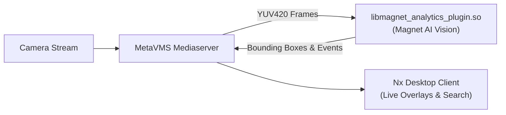

# 🧲 Magnet AI Vision Analytics — Nx Meta Plugin

A native C++ Analytics Plugin (`libmagnet_analytics_plugin.so`) for **Network Optix MetaVMS** (`metavms-server`), branded for **Magnet**.

---

## Architecture Overview


```mermaid
graph LR
    Camera["Camera Stream"] --> Server["MetaVMS Mediaserver"]
    Server -->|YUV420 Frames| Plugin["libmagnet_analytics_plugin.so<br/>(Magnet AI Vision)"]
    Plugin -->|Bounding Boxes & Events| Server
    Server --> Client["Nx Desktop Client<br/>(Live Overlays & Search)"]
```

* **Plugin ID**: `magnet.analytics`
* **Vendor**: `Magnet`
* **Plugin Name**: `Magnet AI Vision Analytics`
* **Supported Objects**:
  * `magnet.person.cashier` — Magnet: Cashier Staff
  * `magnet.person.visitor` — Magnet: Visitor / Queue Member
  * `magnet.vehicle` — Magnet: Audited Vehicle
  * `magnet.plate` — Magnet: License Plate (ANPR)
  * `magnet.animal.horse` — Magnet: Riding Horse
* **Supported Events**:
  * `magnet.event.cashier_unattended` — Cashier Desk Unattended Alert
  * `magnet.event.visitor_unserved` — Customer Waiting Alert
  * `magnet.event.occupancy_exceeded` — Area Capacity Exceeded
  * `magnet.event.vehicle_entry` — Gate Vehicle Entry Crossing
  * `magnet.event.horse_departure` — Horse Ride Departure Audit
  * `magnet.event.horse_return` — Horse Ride Return Audit

---

## How to Build & Deploy on the Linux Server

### 1. Copy Files to the Server

From your development machine, copy this `magnet_nx_plugin/` folder, the SDK zip archive, and your exported ONNX model (`yolo11m.onnx` or `yolo11s.onnx`) to your Linux server (e.g., `172.31.254.130`):

```bash
# Using SCP (replace user and server IP with your credentials)
scp -r magnet_nx_plugin/ yolo11m.onnx "C:/Users/Magnet Busdev-2/Downloads/metavms-server_plugin_sdk-6.1.2.42921-universal.zip" user@172.31.254.130:~/
```

### 2. Run the One-Command Build Script

On your Linux server:

```bash
cd ~/magnet_nx_plugin
chmod +x build_on_server.sh
./build_on_server.sh
```

The script will automatically:
1. Verify / install `cmake`, `g++`, `make`, `wget`, `tar`, and `unzip`.
2. Extract the Nx Meta SDK if needed.
3. Automatically download and configure **ONNX Runtime C++ Linux x64 (v1.18.0)**.
4. Compile `libmagnet_analytics_plugin.so` with YOLO ONNX C++ inference and vectorized NMS.
5. Deploy `libmagnet_analytics_plugin.so` and `libonnxruntime.so` to `/opt/networkoptix-metavms/mediaserver/bin/plugins/`.
6. Deploy `yolo11m.onnx` to `/opt/networkoptix-metavms/mediaserver/bin/plugins/models/`.
7. Restart `networkoptix-metavms-mediaserver`.

---

## Verifying in Nx Desktop Client

1. Open your **Nx Desktop Client** connected to the server.
2. Right-click any camera -> select **Camera Settings**.
3. Go to the **Plugins** tab.
4. You will see **"Magnet AI Vision Analytics"** with vendor **"Magnet"**.
5. Toggle the plugin **ON** and click **Apply**.
6. View the camera tile: you will see the live circulating demo bounding box and periodic test events on the right-side notification panel!

### Per-camera setting: ByteTrack tracking

On the same **Plugins** tab, the **"ByteTrack tracking"** switch (default **off**) picks the tracker for that camera:

| Tracker | Good for | Weak at |
| :--- | :--- | :--- |
| **Off: IoU** (original) | Fast cross-traffic at low inference rates. Objects keep being shown, but get a new ID when they jump far between passes | Occlusions, confidence dips, one-pass false positives (each becomes a record) |
| **On: ByteTrack** | Slow scenes (horse riding, vehicle gate, people): holds IDs through occlusions and confidence dips, and hides one-pass false positives | Objects moving more than about half their width per pass can't be confirmed, so they may not be shown at all |

Switching restarts tracking on that camera, so objects in view get a new record once. Every ~30 s the mediaserver log shows which tracker is active (`[Magnet AI Stats] ... tracker=bytetrack ...`), so you can compare `tracks_created` for the same clip under each setting. See [ADR-007](../docs/adr/ADR-007-vendored-bytetrack-per-camera-tracker-toggle.md).

To compare the two trackers on synthetic scenes without Nx, run `tests/tracker_compare.cpp`. Its header has the one-line build command.

---

## Troubleshooting

### Object records appear in the right panel, but thumbnails are missing

**The camera must be recording.** The plugin's Best Shot carries only a track ID, a timestamp and a bounding box, with no image. The Server builds the thumbnail by cropping that box out of the **recorded** video at that timestamp. If recording is off, there is usually no frame to crop, so records show up without a thumbnail.

* Set the camera to record **Always** (Camera Settings -> **Recording**), or test with Nx **testcamera**. In a test on 2026-09-30, every record got a thumbnail with testcamera.
* If a deployment must run cameras without continuous recording, the fallback is to attach a JPEG crop to the Best Shot from the plugin. See [ADR-006](../docs/adr/ADR-006-nx-best-shot-ordering-and-inference-clock-track-lifetimes.md), Known Open Items.

---

## Directory Structure

```
magnet_nx_plugin/
├── CMakeLists.txt         # CMake build configuration
├── build_on_server.sh     # One-command server build & deploy script
├── plugin.cpp             # Nx 6.1 entry point (createNxPlugin)
├── README.md              # This guide
├── tests/
│   └── tracker_compare.cpp  # IoU vs ByteTrack on synthetic scenes (no Nx needed)
└── src/
    ├── integration.h      # Plugin Manifest & Metadata
    ├── integration.cpp
    ├── engine.h           # Engine singleton, frame capabilities & per-camera settings model
    ├── engine.cpp
    ├── device_agent.h     # Per-stream analytics worker
    ├── device_agent.cpp   # Frame ingestion, Nx track records & metadata packets
    ├── detection.h        # Detection record shared by detector and trackers
    ├── yolo_detector.h/.cpp        # ONNX Runtime YOLO inference
    ├── tracker.h                   # Tracker interface
    ├── iou_tracker.h/.cpp          # Original greedy IoU tracker
    ├── byte_track_tracker.h/.cpp   # ByteTrack adapter
    └── third_party/bytetrack/      # Vendored ByteTrack (MIT), see its README
```
